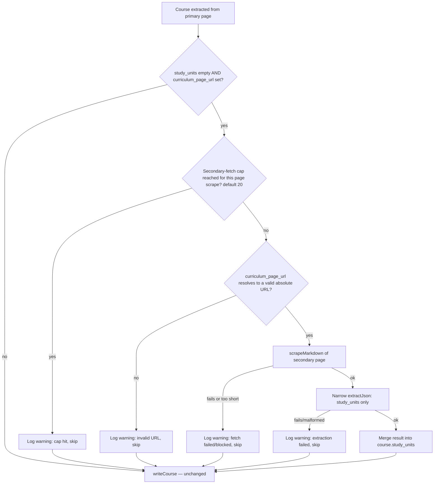

# Study Units Auto-Discovery — Design

> Status: Implemented 2026-08-22 · Date: 2026-08-21 · Stage: fuzzy plan → resolved → shipped · Tone: Relentless (real cost/production-risk tradeoffs) · Scope mode: Hold Scope

## 1. Problem

The data-extraction admin struggles to get unit-level curriculum data (individual subjects/units within a
course, e.g. "COMP101 — Intro to Programming") into the system, because the pipeline only ever scrapes a
course's own overview page, and that page usually doesn't contain unit-level detail — the real curriculum
lives on a separate, institution-specific page the crawler never visits.

Evidence: across all 4 real jobs run so far (Berkeley, Stanford ×2, UGA — 1230 courses total),
`extraction_study_units` has **0 rows**, while every sibling child table populated normally in the same
jobs (`extraction_course_fee_assignments`: 1580, `extraction_intakes`: 1020, `extraction_study_options`:
1397, `extraction_eligibility_requirements`: 1288). This isn't a broken pipeline — it's isolated to this
one field, everywhere.

Root cause verified live: re-scraped a real course's actual `source_url`
(`https://grad.uga.edu/degree/ms-entomology`, UGA's "MS, Entomology" course) through the working Scrapling
pipeline. The page is legitimate degree-program prose — description, admissions, contact info — with zero
unit-level curriculum data. The real curriculum lives at a separate link on that same page ("View Degree
Program Website" → `https://ent.uga.edu/graduate/programs-of-study.html`), which the page worker never
visits for this course. Gemini is correctly returning an empty array from what it's given — this is a
crawl-coverage gap, not an extraction or write bug.

Status quo workaround that already exists and already works, for a narrower case: an admin can manually set
`guided_urls.units_urls` on a job's Context tab, and `extraction-step.worker.ts`'s existing `"units"`
per-course re-extraction step (`handleCourseDataStep`, lines 817–974) will scrape up to 3 of those extra
URLs and merge them into the re-extraction. This only helps when one shared handbook/curriculum page covers
many courses — it can't handle UGA's actual pattern, where every degree program links to its *own distinct*
curriculum page.

## 2. Outcome & dream state

After this ships, study units are captured **automatically on the first pipeline run**, without an admin
needing to notice the gap and manually re-trigger a step later. In 12 months: every course's curriculum is
reliably captured whenever it exists anywhere reachable from the course's own page, cheaply — not by
blindly doubling scrape/LLM cost for every course — and without producing duplicate `extraction_study_units`
rows when courses share a common unit or a job is re-run.

## 3. Scope decision

**Hold Scope** — maximum rigor on exactly what follows, nothing added, nothing cut:

**In scope:**
- Per-course automatic discovery of a secondary curriculum-page link, via a Gemini-flagged field in the
  existing extraction call (not a separate heuristic).
- A narrow, `study_units`-only re-extraction from that secondary page when found.
- Running this inline in `extraction-page.worker.ts`, not a new queue/step type.
- A name/code dedup fix for `extraction_study_units`, mirroring the existing campus-dedup pattern.
- A per-page-scrape cap (20) on secondary fetches, with a logged warning when hit.
- Forward-only: applies to new page-worker runs, not the 1230 already-extracted courses.

**Explicitly deferred** (considered and rejected for this change, not silently dropped):
- Improving the job-wide `guided_urls.units_urls` manual path itself (it already works for its narrower
  case; not broken, just narrower than the automatic case this design targets).
- Extending the same secondary-link pattern to other fields (fees, eligibility) that might have an
  analogous problem — a real possibility, but a separate decision or exception if pursued.
- Backfill tooling for the 1230 existing courses — the existing manual `"units"` step type
  (`extraction-step.worker.ts:955-973`) already covers per-course backfill if ever wanted; no new tooling.
- A UI surface for reviewing/verifying the discovered `curriculum_page_url` before it's used.

## 4. Approach

**Chosen approach:** ask Gemini to flag a `curriculum_page_url` in the *same* per-course extraction call
that already reads the full page (which already includes every markdown link on the page). When a course
comes back with empty `study_units` and a non-null `curriculum_page_url`, scrape that second page and run a
small, single-purpose prompt asking only for `{study_units: [...]}` — inline, in the same worker call, right
before the existing `writeCourse()` call.

| Alternative | Why rejected |
|---|---|
| Keyword-regex heuristic on extracted links (`/curriculum\|course structure\|programs? of study/i`) | The actual scraped page content (verified live on UGA's site) is full of nav-menu items like "Graduate Programs" that would false-positive constantly; regex can't distinguish "this course's own program page" from site navigation the way an LLM reading the whole page can. |
| Full re-extraction combining page 1 + page 2 markdown (mirrors `handleCourseDataStep`'s existing pattern) | Re-running the entire ~9-field-array course schema against combined markdown is meaningfully more expensive than a single-field narrow prompt, for no added benefit — the primary page's other fields are already correctly extracted. |
| Separate queued follow-up step (new queue/step type, or reuse `extraction-step.worker.ts`'s `"units"` step) | Adds a new asynchronous step/queue type for a case the existing page worker can absorb inline; the trigger is narrow (empty `study_units` + a flagged link), so the extra latency only hits the courses that actually need it. |
| Immediate backfill tooling for the 1230 existing courses | The existing manual `"units"` step type already covers per-course backfill; building new bulk tooling now is scope not asked for. |

## 5. Design

### 5.1 Prompt change — `extraction-prompts.ts`

In `courseExtractionPrompt()` (line 78), add one field to each course object in the schema, immediately
after the existing `study_units` field (line 166):

```json
"curriculum_page_url": "URL to this course's dedicated curriculum/course-structure/programs-of-study page, if linked from this page — else null"
```

Add a rule alongside the existing `study_units` rule (near line 191): only set this when a link on *this*
page plausibly leads to *this course's own* detailed curriculum — not a generic "Programs" nav link.

Add a new, narrow prompt+system pair for the follow-up fetch:

```
STUDY_UNITS_SYSTEM = "You are a strict data extraction assistant... extract ONLY the study units/subjects
                       explicitly listed on this page. Respond in valid JSON only."

studyUnitsFromPagePrompt(url, pageText) → returns JSON: { "study_units": [{unit_code, unit_name, credit_points}] }
```
Same per-unit shape as the primary schema (`unit_code`, `unit_name`, `credit_points`) — no new fields, so
`staging-writer.ts`'s existing insert logic needs no shape changes.

*Two-way door* — prompt wording and field placement are trivially adjustable without touching worker logic.

### 5.2 Worker flow — `extraction-page.worker.ts`

Inline, right before the existing `await writeCourse(...)` call (line 306), per course in the loop starting
at line 293:



`writeCourse()` itself is unchanged at the call-site — the course object is enriched before the call, so
the existing single write path handles it uniformly.

*One-way-ish door* — running this inline changes the page worker's cost/latency profile at scale; changing
it to a separate queued step later would mean re-plumbing this logic elsewhere, not just flipping a flag.
Decided deliberately (see decision log), not something to iterate casually in production.

**Cap:** a per-page-scrape counter (one scrape call can `extract courses` plural — a listing page yields
many courses per the prompt's own "if it's a listing page with multiple courses, extract all of them"
rule) bounds secondary fetches at 20. When hit, log a warning (job-visible, not silent) and skip the
remaining courses' secondary fetch for that scrape call — those courses simply keep whatever `study_units`
the primary extraction returned (typically empty, same as today).

### 5.3 Writer change — `staging-writer.ts` (dedup fix)

In the `study_units` handling (lines 387–403), before inserting into `extraction_study_units`, check for an
existing row with the same `unit_name`/`unit_code` for this `job_id` (mirroring the existing
`upsertCampus`/`normaliseCampusName` dedup-by-name pattern already used for campuses). If found, reuse its
id for the `extraction_course_study_unit_assignments` insert instead of creating a duplicate row.

*Two-way door* — purely additive logic change to an insert path; no migration, no data loss risk, easy to
adjust the match key later (e.g. add fuzzy matching) without touching callers.

## 6. Failure modes & edge cases (zero-silent-failures)

- **`curriculum_page_url` is relative or malformed** — validate with `new URL()` before fetching; on
  failure, log a warning and proceed with empty `study_units` (same as today), never throw and fail the
  whole course write.
- **Secondary page fetch fails or returns short/blocked content** — same: log, skip, proceed. One course's
  secondary-fetch failure must never fail the primary course write or the whole page-worker job.
- **Narrow re-extraction returns malformed JSON** — caught by the existing `extractJson` error handling
  pattern used elsewhere in this worker; treat as empty `study_units`, log, proceed.
- **Cap reached mid-scrape** — logged explicitly (not a silent truncation), so it's visible in worker logs /
  job events if a listing page turns out to have far more courses needing this than expected.
- **Dedup match on a null/empty `unit_name`** — `writeCourse`'s existing guard (`if (!unit.unit_name)
  continue`, line ~391 per the investigation) already skips units with no name; the new dedup check only
  applies to units that already passed that guard.
- **Job re-run / re-processing the same page** — dedup fix directly addresses this: re-running a job (or a
  page worker retry) must not pile up duplicate `extraction_study_units` rows for the same unit.

## 7. Open questions / risks

- Whether the same secondary-link pattern should later extend to `fees`/`eligibility` (explicitly deferred,
  not resolved here — flagged as a real possibility in section 3).
- Whether `data-extraction/CLAUDE.md`'s parity-first rule needs a second documented exception (like the
  Scrapling one added 2026-08-20) — this is a new capability beyond V2 parity. Not yet added; should be
  added when this ships, matching the existing precedent.

## 8. Decision log

| Decision | Rationale | Reversibility |
|---|---|---|
| Focus on automatic per-course discovery, not the job-wide manual path | `guided_urls.units_urls` already solves the shared-handbook case; the unsolved case is per-course-specific links | n/a (scoping decision) |
| Detection via Gemini-flagged `curriculum_page_url` in the same call | Zero extra cost for detection; LLM can distinguish the course's own page from nav-menu noise, regex can't | Two-way |
| Narrow `study_units`-only re-extraction on the second page | Cheaper than full combined re-extraction; primary page's other fields don't need re-checking | Two-way |
| Runs inline in `extraction-page.worker.ts`, not a new queued step | Trigger is narrow (empty `study_units` + flagged link); avoids new step-type/queue plumbing for a boundable cost | One-way-ish — decided deliberately, not to be flipped casually |
| Include the `extraction_study_units` dedup fix in this same change | This feature is exactly what will start generating real duplicate volume; small, isolated, mirrors existing campus-dedup pattern | Two-way |
| Cap secondary fetches at 20 per page scrape, logged when hit | Bounds worst-case cost if a listing page yields many courses that all get flagged; visibility over silent truncation | Two-way |
| Forward-only — no backfill tooling for the 1230 existing courses | Existing manual `"units"` step type already covers per-course backfill if ever wanted | Two-way |
| Scope mode: Hold Scope | All sub-decisions above were already tightly reasoned through the dialogue; no reason to expand or cut further | n/a |
