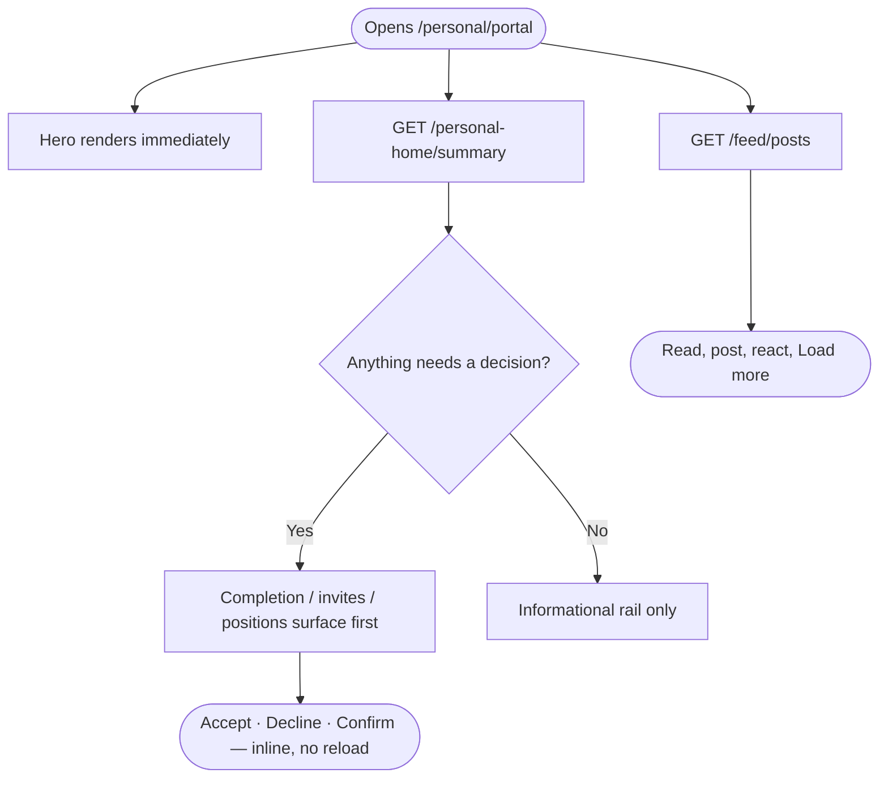

# Personal Portal — Home / Dashboard (V3) — PRD

> **Status:** Implemented | **Owner:** Wonjala Joshi | **Last updated:** 2026-08-11
> **Parent:** Personal Portal (V3) PRD · Epic 2 — Home
> **Surface:** `/personal/portal` | **Stack:** Next.js 16 App Router + Redux Toolkit · Fastify 5 + Knex + Postgres
> **One-liner:** V2 buried every actionable signal in a desktop-only sidebar; V3's Home puts completion, invites and position confirmations on every device, and makes the completion percentage that gates enquiries a single backend-authoritative number.

This documents what shipped, not an aspiration. Where the V2 PRD asked for something V3 deliberately does not do, that is recorded as a scope cut with the reason.

---

## 1. Problem

`/personal` is the landing page for every onboarded individual. In V2 it was three regions — hero, feed, right rail — and **all** the actionable state lived in the rail, which was `hidden lg:block` (`PersonalHomeSidebar.tsx:59`). On a phone, the primary device for this persona, Home was a hero and a feed and nothing else.

Concrete V2 defects this replaces:

| V2 defect | Evidence | V3 behaviour |
|---|---|---|
| Profile completion invisible on mobile | `PersonalHomeSidebar.tsx:59` — `hidden lg:block` | Completion renders on every breakpoint, **above** the feed below `lg` |
| Enquiries stat capped at 5 | the list was sliced to 5 before being counted | `enquiries_count` is a real `COUNT(*)`; only the *listing* is limited to 5 |
| Completion % and its badges from different sources | SQL scored qualification rows; the UI badges read profile columns; the SQL's max score was 9/10, so the card never disappeared | One backend function returns both, from one pass. All ten points are reachable (asserted in tests) |
| "Search services" went to public `/search` while the nav went to `/personal/search` | `PersonalHomeSidebar.tsx:118` | One destination per label |
| Personal feed posting was broken | `POST /feed/posts` required `business_id: uuid`, the personal composer sent none → 400 | `business_id` is nullable; a personal post is a first-class case |
| Attachments never uploaded | V2's composer previewed files as base64 and `media` was always sent as `[]` — the server comment even said so | Files upload to GCS before posting; the post carries storage paths and the timeline renders them |
| `window.confirm` for destructive actions | `StudentServices.tsx:36` | A real `Dialog`. Deleting a post asks first ("Delete post?"), keeps the dialog open and toasts on failure so a failed delete is never mistaken for a successful one, and never uses `window.confirm` |
| Feed visibility enforced only by Postgres RLS | V3 has no RLS | Visibility is enforced in the query, with tests per rule |

---

## 2. Scope

### In scope (shipped)
- `/personal/portal` — hero, feed region (composer + cursor-paginated timeline + reactions), actionable rail
- **Composer:** collapsed pill → expanded editor with post-type pills, **Write with AI**, character counter, a "Visible to" selector, **real image and video attachments**, and Cancel/Post
- **Post card:** per-type left accent stripe and badge, author + relative time + visibility line, overflow menu (Delete for own posts, behind a confirmation dialog), "Read more" clamp on long bodies, media grid, and a reaction row of grouped emoji pills with reactor avatars, a "+N" overflow and an emoji picker
- Backend-authoritative profile completion, recomputed on every scoring write, with a re-runnable backfill
- Pending business invites and position confirmations, actioned inline
- Notification unread count in the portal shell
- Mobile ordering: decisions above the feed, information below

### Out of scope, and why
| Cut | Reason |
|---|---|
| **Sponsored / ad card** | V3 has no ad system at all. The V2 PRD consumes this from a system that does not exist. |
| **Feed comments** | No table, no API. The V2 card design shows a comment count and a Comment button; rendering either would be a control that does nothing, so the card omits them until the feature exists. |
| **Post acknowledgements** ("You acknowledged this post") | Same reason — `ack_required` / `ack_deadline` / an acknowledgements table do not exist here. |
| **@mentions in post bodies** ("with @Someone") | No mention storage or resolution, so no data to render. |
| **Audience groups in "Visible to"** (My Students / My Representatives / My Ambassadors) | Those relations do not exist in V3. Shipping them as labels that silently resolve to "everyone" would misrepresent who can see a post. The selector offers only what the visibility matrix can enforce — see §5.5. |
| **Enquiry compose / distribute / list page** | Owned by the Enquiries epic. Home reads the recent five and the total. |
| **Favorites add / remove / page** | Owned by the Explore epic. Home reads the count. |
| **Notifications list / mark-read** | Owned by the Notifications epic. Home's shell needs only the unread count. |
| **The onboarding gate** | Removed for now by decision: an un-onboarded user lands on the portal rather than being redirected to `/personal/onboarding`. The route and its view are untouched and still reachable directly; restoring the gate means re-adding one effect in `personal-shell.tsx`, where the exact code (including the mandatory loop guard) is kept as a comment. **The enquiry gate is unaffected** — profile completion is enforced server-side and has nothing to do with this. |
| **Course / agent / scholarship favourites** | Those tables do not exist yet in V3 — see §5.3. |

---

## 3. User flow



---

## 4. States — all six

| State | Trigger | Behaviour |
|---|---|---|
| **Happy** | Onboarded user, feed has content | Hero → composer → timeline, rail per breakpoint |
| **Empty** | New account, no posts, 0% profile | Composer prompt + completion card + quick actions carry the page; never a blank canvas |
| **Loading** | Any region fetching | Per-region skeletons; regions never block each other (separate thunks, separate status fields) |
| **Error** | Feed fetch fails | Inline `SectionError` + Retry inside the feed region; hero and rail unaffected |
| **Malformed response** | The deployed backend omits a field the UI indexes into (older build, partial payload, proxy) | The API layer normalizes every array and scalar at the boundary (`real-api.ts`), so a missing `media` or `badges` cannot throw during render. Each region is additionally wrapped in a `RegionBoundary`, so even an unforeseen render error shows that region's retry instead of replacing the page with "Something went wrong" |
| **Partial** | One summary source fails | `allSettled` → 200 with the source named in `degraded`; that card shows an error, **not** a confident zero |
| **Edge** | See below | — |

Edge cases handled:
- **Geolocation denied / weather unavailable** → hero silently switches to world clocks. No toast, no empty weather frame; the saved widget preference is not overwritten, and **re-selecting the weather toggle retries**. (The first version pinned the hero to clocks for the rest of the session, so the cloud button silently did nothing once weather had failed.)
- **Weather still loading** → a skeleton, not an empty frame. The permission prompt can sit unanswered for a while, and a blank box reads as broken.
- **Profile at 100%** → completion card absent at every breakpoint.
- **Invite already actioned elsewhere** → the respond route returns 204 and the row disappears without an error; the read path re-verifies pending invites against the tenant row, so a stale Accept button is never offered.
- **Position changed after an earlier confirmation** → reappears as `kind: "changed"` with `previous_position`, and re-confirming retitles the same work-experience row (no duplicate, original start date preserved).
- **Expired invite** → withheld and lazily marked `expired`.
- **Un-onboarded user** → lands on Home like anyone else (the gate is removed for now). Their completion card simply reads a low percentage, which is the honest prompt to finish the profile.
- **Reaction double-tap / emoji change** → count moves only when the row set actually changes.

---

## 5. Implementation notes

### 5.1 Schema audit — what was reused
Every migration in `database/migrations/{globalyapp,business,superadmin}` was read before proposing a table.

**Reused, not recreated:** `platform_user_profiles` (**already had `completion_percentage`** — no new column), `platform_user_qualifications`, `platform_user_language_tests`, `platform_user_work_experiences`, `user_business_index`, `countries`, `institutions`, and — critically — **`agent_invitations`** (per-tenant) plus the existing `inviteAgent` / `acceptInvitation` flow in `modules/agents`. An invitation model already existed, so none was duplicated and no invite columns were bolted onto `user_business_index`.

**Genuinely absent, therefore created:** feed posts + reactions, enquiries, favorites, notifications, and a globalyapp-side invitation index.

**Governing principle:** Home is an *aggregator*. `modules/personal-home` has only `index.ts`, `routes/`, `services/` — no repositories, no migration, no tables. Each domain owns its own schema.

### 5.2 ID convention
V3 is not uniformly UUID: first-class domain entities use `increments("id")` (`platform_users`, `businesses`, `institutions`, `user_business_index`), while profile sub-resources, auth tokens, audit logs and invitations use `uuid`. New domain tables follow the integer convention and match the FK types they join to; `business_invitation_index` uses `uuid`, matching every other invitation table. `gen_random_uuid()` is used with no `CREATE EXTENSION` — correct on Postgres ≥ 13 (verified against PG 18).

`feed_reactions` is the one deliberate exception: a **composite primary key `(post_id, platform_user_id)`** and no surrogate id, because that pair is the natural key, the API addresses reactions by `(post, caller)`, and a surrogate would be an unused column still needing a unique index on the same pair.

### 5.3 Tables added
| Table | Notes |
|---|---|
| `feed_posts` | `business_id` **nullable** (fixes the V2 personal-posting bug); timeline index on `(deleted_at, is_pinned, created_at, id)` to serve the cursor |
| `feed_posts.media` *(alter)* | `jsonb` default `[]` — `[{ storage_path, type, mime_type }]`. Added once media was actually implemented; the column would otherwise have been a promise the app did not keep |
| `feed_reactions` | composite PK; hard delete |
| `enquiries` | index `(platform_user_id, created_at)` |
| `user_favorites` | **typed targets** (`institution_id`, `country_id`) with a CHECK for exactly one, and partial unique indexes **`WHERE deleted_at IS NULL`** so a soft-deleted favourite cannot permanently block re-favouriting. A generic `item_type + item_id` was rejected: it has no referential integrity and V3 has no courses/agents/scholarships to point at — that is exactly why V2's favourites rendered raw UUIDs |
| `notifications` | index `(platform_user_id, read_at, created_at)` |
| `business_invitation_index` | globalyapp-side read model: normalized email, nullable `platform_user_id`, **`token_hash` (sha256 — never the plaintext token)**, status, `expires_at`, audit fields, `synced_at`, `sync_error` |
| *(alter)* `user_business_index` | `position`, `position_updated_at` |
| *(alter)* `platform_user_work_experiences` | `source_membership_id`, `confirmed_position` (the snapshot that makes a later position change detectable) |

### 5.4 Profile completion — one definition
`modules/platform-users/services/profile-completion.service.ts`. Ten points: name 1, nationality 1, country of residence 1, ≥1 qualification 3, ≥1 language test 1, budget min+max 1, ≥1 preferred destination 1, photo 1. The five UI badges are derived from the same booleans in the same pass, so "all badges green at 80%" is structurally impossible.

- `recomputeCompletion()` runs inside every write that affects the score: profile patch, qualification and language-test add/edit/delete, and photo upload/delete. **Work-experience writes are deliberately excluded** — work experience scores nothing, so recomputing there is wasted work (asserted in tests).
- `GET /platform-users/me` returns a freshly computed `{ percentage, badges }`, so a stale column can never mislead the client. The column remains authoritative for server-side gating.
- **Backfill is a script, not a migration** (`scripts/backfill-completion.ts`, `npm run backfill:completion`, supports `--dry-run` and `--user-id=`). Migrations stay schema-only; importing runtime service code into one couples schema history to code that keeps changing and breaks replay. The script uses the same `computeCompletion()` so the rollout and the runtime cannot diverge, and a second run reports zero changes.
- The percentage cannot be forged: `ProfilePatchSchema` is `.strict()`, so a `completion_percentage` in the body is rejected outright.

### 5.5 Feed
**Visibility, enforced in the query** (V3 has no RLS):

| `visibility` | Visible to |
|---|---|
| `everyone` | any authenticated platform user |
| `business` | members of `business_id` per `user_business_index` |
| `private` | the author only |

`visibility='business'` with a null `business_id` is rejected at write, so the invisible-to-everyone state cannot exist. Posting to a business you are not a member of is 403.

**Cursor pagination:** `GET /feed/posts?postType=&limit=20&cursor=` — base64url of `{is_pinned, created_at, id}`, keyset-compared on the same triple as the ORDER BY. No OFFSET, so a post inserted mid-pagination cannot duplicate or skip a row. `limit` capped at 50 server-side.

**The cursor timestamp is the database's own text form, not a JS `Date`.** `toISOString()` truncates to
milliseconds while Postgres stores microseconds, so two posts created in the same millisecond made the
truncated cursor land at or ahead of a row that should still follow it — and that row was skipped on every
page, silently gone from the feed. The query therefore selects `created_at::text as cursor_ts` purely to
build cursors, casts it back with `?::timestamptz` in the comparison, and strips it before the response.
Covered by a test that inserts posts sharing one millisecond with distinct microseconds.

**One post shape, one query.** `hydratedPostQuery(viewerId)` produces the author card, business card, the
viewer's own reaction and server-decided `is_mine`; both the timeline *and* the create response go through
it. Returning the bare inserted row from create is what made a just-posted card render as "Someone" with no
delete action until a reload — a test now asserts the two responses have identical key sets.

**Reaction summaries** are grouped per emoji, most-reacted first, each carrying up to 3 reactors for the
avatar stack (`count` is uncapped, so the card shows "+N" beyond the visible faces). Fetched with **one
query per page**, not per post. The client mirrors the same grouping rules when a reaction is added or
removed, so the pills, avatars and total stay consistent without a refetch.

**Reactions are explicit, never a toggle:**
| Route | Contract |
|---|---|
| `POST /posts/:id/reactions` | add **or update** the caller's reaction. Idempotent. |
| `DELETE /posts/:id/reactions` | remove it. Idempotent — no row is still 204. |

**Visible to** offers only what the query can enforce — `Everyone` and `Only me` (`private`). `business` exists in the model and is enforced, but the personal composer has no business context to post into, so it is not offered there. V2's audience groups are deferred until those relations exist.

**Storage has a local fallback.** No environment here had `GCS_BUCKET_NAME` set, which meant every upload
failed with "GCS_BUCKET_NAME not configured" — the feature could not be used or reviewed locally at all.
`storageService` now selects a driver: GCS when a bucket is configured, otherwise
`shared/storage/local-driver.ts` writing under `LOCAL_STORAGE_DIR` (`.uploads`, gitignored). Callers are
unchanged. Reads go through **`GET /api/v3/files/local`**, which is deliberately public because a browser
cannot attach an `Authorization` header to an ``/`<video>` src — authority travels in the URL as an
HMAC over `(path, expiry)`, the same role a GCS signed URL plays. Paths are resolved inside the storage root
only, so `../` cannot escape it, and the served `Content-Type` comes from the recorded `uploaded_files` row
rather than being guessed from the extension. `API_PUBLIC_URL` is the origin the browser uses to reach the
API (media URLs must be absolute); it defaults to `http://localhost:$PORT`.

**Media** (`feed_media.service.ts`, `POST /feed/media`): files upload **before** the post is created, so the post request stays small JSON and the preview shows the real uploaded object. Feed media passes its own allow-list to `validateFile()` — images (`jpeg/png/webp/gif`) plus video (`mp4/webm/quicktime`) — rather than widening the shared `ALLOWED_MIME_TYPES`, which has no video types and is used by every other upload in the app. Each upload is recorded in `uploaded_files` under category `feed-media`, and **`assertOwnedMedia()` rejects any storage path the caller did not upload** — otherwise a client could attach any path it could guess. Max 4 attachments; a media-only post (no caption) is valid, an entirely empty one is not. Signed view URLs are minted per read (they expire) and a failure to mint one degrades that item rather than breaking the timeline.

**Write with AI** (`shared/ai/gemini.ts` + `feed-ai.service.ts`): `POST /feed/ai/compose` drafts from scratch or rewrites the current draft, tuned by post type. `generateText()` lives in `shared/` alongside mail/queue/storage rather than reaching into `modules/superadmin/data-extraction/lib/llm-client.ts`, which is that module's internal JSON-extraction client — same provider, different contract. Rate-limited to 10/min. `GET /feed/ai/available` reports whether a provider key is configured, and the composer **hides the affordance entirely** when it is not, rather than offering a button that can only fail. A missing key is a 400 with a clear message, not a 500.

The reaction count is **not** derived from the upsert's row count: `INSERT … ON CONFLICT DO UPDATE` reports 1 for both a fresh insert and an emoji change, which would wrongly increment on a re-react. Instead one transaction does `SELECT … FOR UPDATE`, branches on existence, and increments only for a genuinely new row; `ON CONFLICT DO NOTHING` plus the row count closes the double-tap race, and DELETE clamps with `GREATEST(count - 1, 0)`. `is_mine` and `my_reaction` are decided server-side — the client never infers authorship.

### 5.6 Invitations — cross-connection dual write
`agent_invitations` lives in a **per-tenant schema** reached through a separate Knex instance; the index and `user_business_index` live in globalyapp. Separate instances mean separate connections, so **they cannot share a transaction** — any design that wraps them in one `trx` is wrong.

Instead: **tenant first (system of record), index second (derived)**, every index write idempotent (`ON CONFLICT (tenant_invitation_id) DO UPDATE`), each post-commit write wrapped in a bounded retry that never fails the user-facing request.

`acceptInvitationById(...)` was extracted from the token-based `acceptInvitation(...)`, and `declineInvitationById(...)` added — **decline updates the tenant row first and clears its token**, because an index-only decline would leave the tenant invitation `pending` and the emailed link would still accept it. The authenticated portal route addresses invitations by `tenant_invitation_id`, never by token: `token_hash` is sha256 and cannot reconstruct a token.

**Reconciliation has three passes** (`modules/agents/jobs/reconcile-invitations.ts`, `npm run job:reconcile-invitations [-- --full]`):
1. **Tenant → index, incremental** — cheap catch-up on `created_at > watermark`.
2. **Tenant → index, full ID audit** — set-difference on ids. Required because the watermark alone has a permanent blind spot: if an older invitation fails to index while a newer one succeeds, the watermark advances past the failed one and every later incremental run skips it forever.
3. **Index → tenant, state verification** — because *existence* is not enough. If the tenant accept succeeds and the index status write fails, the same outage prevents writing `sync_error`, so the row keeps a valid `synced_at` and a future `expires_at`, carries no flag, and its id exists on both sides. Only re-reading the tenant row reveals it. This pass has a frequent flagged sweep and a periodic full reverification of every non-terminal row, comparing status / `expires_at` / `responded_at` / invitee identity / membership existence. The read endpoint additionally re-verifies every pending invite before returning it, so a drifted index never shows the user a stale action.

Authorization: an invite matches the caller by `platform_user_id` **or** the email on the caller's own `platform_users` row (normalized). A client-supplied email is never used. Terminal invites respond 204 with no state change.

### 5.7 Aggregator
`GET /personal-home/summary` → `{ completion, enquiries_count, recent_enquiries[5], favorites_count, pending_invites, position_updates, degraded[] }`, composed with `Promise.allSettled`. Notifications are deliberately **not** here — the bell must work on every personal route, so it is a shell concern with its own slice and endpoint.

### 5.8 Frontend
`src/app/personal/portal/` in the `frontend/AGENTS.md` shape (`apis/{types,mock-data,real-api,index}`, `store/home-slice.ts`, `const/`, `types/`, `utils/`, `components/`, thin `page.tsx`, pass-through `layout.tsx`), reducer registered as `home`. Separate `summaryStatus` / `feedStatus` keep regions independent. Client naming mirrors the API — `setReaction` / `removeReaction`; the word "toggle" appears nowhere on either side.

Completion is **displayed, never computed**: the old `personal/profile-completion.ts` was deleted and `profile-view.tsx` now reads the same API field Home does.

Hero: `Intl.DateTimeFormat` + `setInterval` for the clock and `Intl.supportedValuesOf("timeZone")` for the picker — no `date-fns-tz`, no timezone constants file. Preferences persist via `usePersistedChoice`, built on `useSyncExternalStore` so there is no setState-in-effect and no hydration mismatch. The weather widget is behind its own boundary and secondary by design.

**World clocks are managed, not hardcoded.** The user's own zone leads the row labelled "Default" and cannot be removed — it is the reference the others are read against. Up to four more are added from a searchable picker that shows each zone's live GMT offset, and removed with an X on hover. Offsets come from `Intl` (`timeZoneName: "longOffset"`), so DST is always correct rather than a stored number going stale. Persisted in `personal-world-clocks`. Search matches **city and region** (the IANA id) — not country names, which would need a zone→country lookup table this deliberately doesn't carry.

The weather icon is chosen from the raw WMO code, per forecast day as well as for the current reading, so the strip doesn't repeat one generic glyph.

The hero gradient is unchanged (`from-primary via-primary to-primary/70`) — it tracks the theme's primary colour rather than hardcoding a hue.

Layout: `lg+` is `grid-cols-3` (feed spans 2); below `lg` a single column ordered hero → actionable → composer → timeline → informational.

**Width and rhythm.** The shell centres both the top bar's contents and the page body on one shared width (`mx-auto w-full max-w-7xl px-3 sm:px-4 md:px-6`), so the logo lines up with the content instead of hugging the screen edge and the dashboard stops stretching across ultrawide displays. 1280px matches the app's `.container` cap, but padding is set explicitly rather than inherited — `.container` hardcodes `padding-inline: 2rem`, which is too much on a phone and would fight the responsive classes. Spacing uses one scale: **4 (16px) between cards, 6 (24px) between regions and columns**.

New shared plumbing: `httpPostNoContent` and `httpPostForm` in `lib/api/http.ts` (the 204 routes would throw on `res.json()`; multipart must not carry a hand-set `Content-Type`).

**Resilience, learned the hard way.** A frontend pointed at a backend that predated the `media` column rendered `post.media.length` on `undefined` and React unmounted the whole page — "Something went wrong" where a hero, a composer and five cards should have been. Two fixes, both at the level the problem actually lives at:
1. **Normalize at the boundary.** `real-api.ts` defaults every array and scalar the UI indexes into. The wire shape is whatever the deployed backend sends, not what the TypeScript type claims, and one `?.` per call site is a fix that decays.
2. **Boundary every region.** `RegionBoundary` (a class component — `componentDidCatch` still has no hook equivalent) wraps the hero, composer, feed, and both rail groups. Home's contract is that one broken region does not take the others down; before this, only *fetch* failures were contained, not *render* failures.

---

## 6. Acceptance criteria — and how each was verified

| # | Criterion | Verification |
|---|---|---|
| 1 | Completion card renders on every viewport when < 100%, above the feed below `lg`, absent at 100% | `completion-card.tsx` returns null at ≥100; ordering in `home-view.tsx`; **not** browser-verified — see §7 |
| 2 | Completion is backend-authoritative and its badges agree with its percentage | `completion.test.ts` — all ten points reachable, badge/percentage agreement across partial profiles |
| 3 | A client cannot forge the percentage that gates enquiries | `completion.test.ts` — `.strict()` rejects it; the stored column always equals the computed value |
| 4 | Existing users' stored percentages are corrected | `completion.test.ts` — backfill corrects stale rows; second run reports 0 changes |
| 5 | Stat tiles show true totals | `home.test.ts` — 12 enquiries → `enquiries_count: 12`, `recent_enquiries.length: 5`. Live: confirmed `12` |
| 6 | A post can only be deleted by its author; the author comes from the JWT | `feed.test.ts` — 403 for others; forged author rejected |
| 7 | Feed visibility is enforced server-side | `feed.test.ts` — everyone/business/private each asserted from three viewpoints |
| 8 | Feed paging is complete and stable | `feed.test.ts` — every post exactly once; mid-pagination insert neither duplicates nor skips |
| 9 | Reaction counts stay correct | `feed.test.ts` — repeat add, emoji change (count unchanged), double remove, concurrency race, count == row count. Live: confirmed 1 after an emoji change |
| 10 | Invites are authorized and idempotent | `invitations.test.ts` — 403 for a non-addressee, silent 204 on terminal rows, case-insensitive email matching, no client-supplied email |
| 11 | Decline reaches the source of truth | Implemented in `declineInvitationById` (tenant first, token cleared). Tenant-side assertion needs a provisioned tenant schema — see §7 |
| 12 | Index drift cannot persist | `invitations.test.ts` — silent drift invisible to the flagged sweep but visible to reverification; the watermark blind spot and the audit that closes it; idempotent membership repair |
| 13 | Position confirmation handles later changes | `home.test.ts` — new → confirm → change → `kind: "changed"` + `previous_position` → re-confirm updates the same row. Live: confirmed both |
| 14 | Own rows only | `home.test.ts` — another user's enquiries/favourites/notifications never counted |
| 15 | One failing source degrades one card | `home.test.ts` — 200 with the source in `degraded` (real failure, table taken offline) |
| 16 | Favourites keep referential integrity and allow re-adding | `home.test.ts` — CHECK rejects 0 and 2 targets, cascade on target delete, soft-delete re-add |
| 17 | The bell works on every personal route without Home | own slice + endpoint, dispatched by `PersonalShell` |
| 18 | *(withdrawn)* Onboarding redirect cannot loop | The gate is removed for now, so there is no redirect to loop. If it is restored, this criterion comes back with it — the loop guard is not optional, because `onboarding-view` pushes to `/personal/profile` on completion |
| 19 | Only media the caller uploaded can be attached | `feed-media.test.ts` — another user's path and an invented path both 400. Live: confirmed |
| 20 | Only images and video are accepted | `feed-media.test.ts` — `kindFor` allow-list. Live: `text/plain` upload → 400 |
| 21 | A media-only post is valid; an empty one is not | `feed-media.test.ts` |
| 22 | AI compose is strict, bounded, and degrades cleanly without a key | `feed-media.test.ts` — unknown fields 400, over-long instruction 400, no key → 400 with a clear message. Live: confirmed `available: false` → 400 |
| 23 | Every post comes back with a `media` array, never null | `feed-media.test.ts` — asserts the server-side contract the client normalizer backs up |
| 24 | A missing field or a render error cannot blank the page | Normalizer in `real-api.ts` + `RegionBoundary` per region. The failure it fixes was observed against a stale backend; the *fix* is verified by typecheck and review, not by an automated test — there is no frontend runner |
| 25 | Image and video upload works with no GCS bucket | `storage-local.test.ts` — upload → signed URL → **read back with no Authorization header**, bytes and content-type intact. Live: confirmed 201 then HTTP 200 `image/png` |
| 26 | A signed file URL cannot be forged, replayed after expiry, or repointed | `storage-local.test.ts` — tampered signature 403, unsigned 400, expired refused, a signature for one path cannot read another, `../` cannot escape the storage root |
| 27 | A new post shows its author immediately, with its own actions | `feed.test.ts` — the create response carries author name/photo and `is_mine: true`, and has the same key set as a listed post. Live: confirmed |
| 28 | No post is skipped when timestamps collide | `feed.test.ts` — five posts in one millisecond page out exactly once each; `cursor_ts` never reaches the client |
| 29 | The card shows who reacted, not just how many | `feed.test.ts` — grouped by emoji, sorted by count, reactor stack capped at 3 while `count` is not, group totals sum to `reactions_count`, and changing an emoji empties the old group instead of leaving a zero |

**Automated:** 50 backend tests, all passing (`DB_NAME=globalyapp_test npm test`). Migrations apply, roll back and re-apply cleanly. `npx tsc --noEmit` clean on both sides. `yarn lint` introduces no new errors (2 pre-existing errors remain in `auth/`). `next build` succeeds with `/personal/portal` compiled. Live API walk against a seeded user confirmed the summary, unread count, post creation, reaction semantics, position confirmation and position change.

---

## 7. Not verified — needs a browser pass

No browser automation exists in this repo, so the following were built to spec but **not** observed in a running browser:
- The authenticated client render (the token lives in `localStorage`, so server-rendered HTML shows the empty shell)
- Responsive ordering at 375px vs 1440px
- Invite accept/decline and position confirm as clicks, and the two-tab stale-invite case
- Geolocation denial → world-clocks fallback, and preference persistence across sessions
- **The composer's interactive states** — collapsed → expanded, type pills, character counter, the "Visible to" popover, picking a file and seeing its preview, and Cancel discarding the draft
- **A real GCS round-trip.** No bucket is configured anywhere here, so the GCS branch of `uploadFile` / `getSignedViewUrl` is unexercised. The **local driver** branch — which is what runs without a bucket, and therefore what runs in development — is covered end-to-end by `storage-local.test.ts` and was verified live.
- **A real Gemini call.** `GEMINI_API_KEY` is unset here, so only the not-configured path (`available: false` → 400) was observed. With a key set, `POST /feed/ai/compose` needs one manual check.

`declineInvitationById`'s tenant-side effect also lacks an automated assertion: it needs a provisioned per-business schema, which requires the tenant migration runner.

---

## 8. Launch reality — which cards are empty and why

No V2 data is migrated and two domains have no producers yet. This is recorded rather than papered over, and no seed or fake producer was added to make Home look populated.

| Card | Producer in this scope | At launch |
|---|---|---|
| Completion | the user's own profile, recomputed + backfilled | real |
| Feed | the composer built here | real |
| Business invites / position updates | the existing `inviteAgent` flow | real as soon as a business invites someone |
| Favorites count | none until the Explore epic | **0** — the count is real, there is nothing to count |
| Recent enquiries | none until the Enquiries epic | **empty**, with gate-aware copy |
| Notification unread count | none until owning epics emit notifications | **0**, badge hidden |

For demos, seed via `database/seeders/globalyapp` — never through production code paths.

---

## 9. Operational notes

```bash
# migrate
npm run migrate:globalyapp        # on Windows this script fails (it invokes the .bin shell wrapper);
                                  # use: node --import tsx node_modules/knex/bin/cli.js migrate:latest \
                                  #        --knexfile knexfile.ts --env globalyapp
npm run backfill:completion       # one-time (and re-runnable) completion rollout
npm run job:reconcile-invitations # add -- --full for the ID audit + full state reverification
DB_NAME=globalyapp_test npm test  # see tests/README.md — the scratch DB is mandatory
```

Schedule the reconciler: incremental frequently, `--full` on a slower cadence.

**Restart the backend after pulling this.** New routes (`/feed/media`, `/feed/ai/*`) and a new migration land together — a long-running `tsx watch` process that misses the reload serves 404s for the new routes and returns posts without `media`. If `/api/v3/feed/ai/available` 404s, the process is stale, not misconfigured.

---

## 10. Follow-ups

| Item | Why |
|---|---|
| Hash the invite token in `agent_invitations` too | It is plaintext today. That is what lets the reconciler rebuild `token_hash`, so hashing it requires changing that recovery path in the same commit |
| Fix `migrate:globalyapp` for Windows | It invokes `node_modules/.bin/knex`, a shell wrapper esbuild cannot parse |
| Notification producers | Until they exist the bell is permanently 0 |
| Feed comments and acknowledgements | Deliberately unbuilt; add tables with the features |
| Audience groups for "Visible to" | Needs student / representative / ambassador relations to exist before the options mean anything |
| `GEMINI_API_KEY` per environment | Without it "Write with AI" is hidden (the composer probes `/feed/ai/available` and omits the affordance rather than offering a button that fails) |
| A GCS bucket for staging/production | Uploads work without one via the local driver, but local files do not survive a container restart and are not shared between instances. Set `GCS_BUCKET_NAME` and the same code path switches over with no changes |
| Video transcoding / thumbnails | Videos are served as uploaded. Fine for short clips; a large upload is a large download |
| Ads / sponsored card | Needs an ad system to exist first |
| Frontend test runner | There is none; the completion logic that a frontend could regress now lives server-side, but the Home components have no automated coverage |
