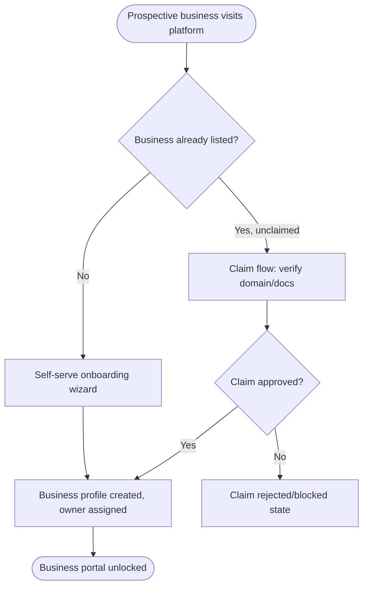
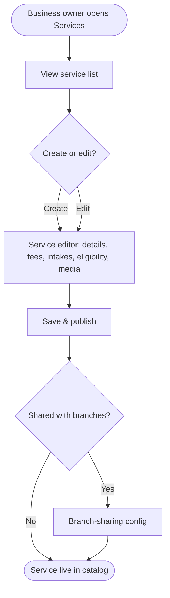
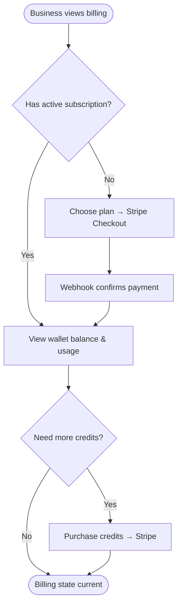
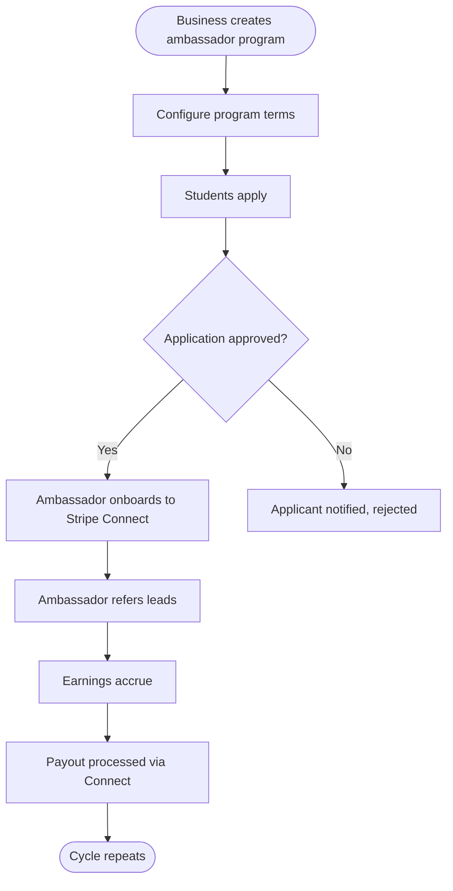
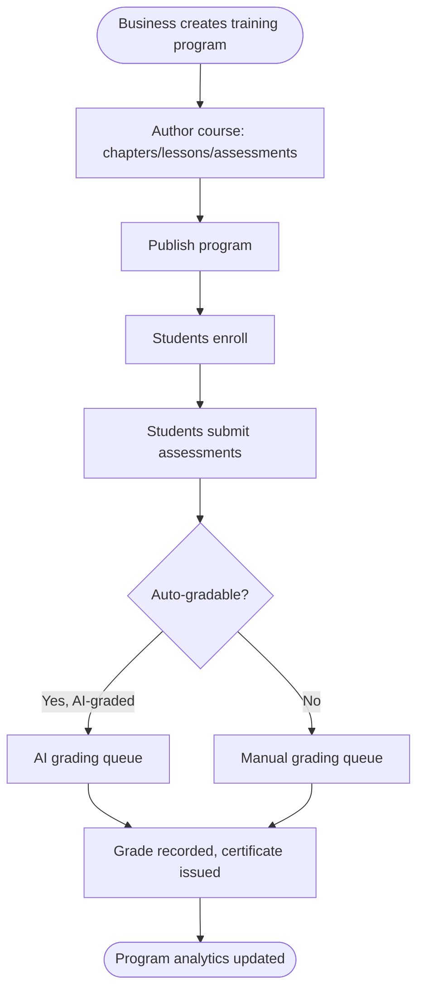
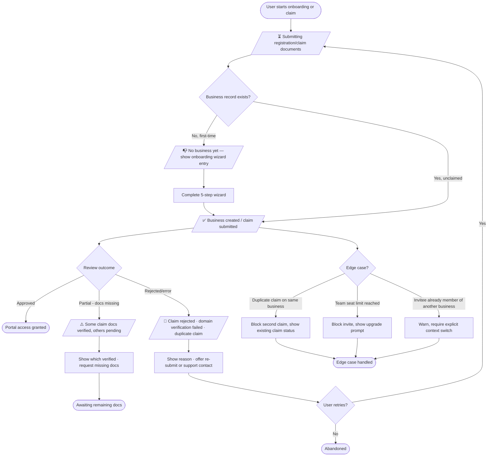

# Business Portal Migration (GlobalyApp V2 → GlobalyApp-v3) — PRD

> **Status:** Draft | **Owner:** Sunita Gurau | **Last updated:** 2026-08-23
> **Project:** GlobalyApp-v3
> **One-liner:** V2's Business Portal (18 modules, Vite/React + Supabase) is production-complete while V3's equivalent is partially scaffolded → migrate every module feature-by-feature onto V3's Fastify/Knex + Next.js/Redux architecture → business users get full parity on V3 with no functional regression.

> **Source repos**
> - Legacy: `/home/sunita-gurau/Projects/Globaly App New/GlobalyApp` (Vite + React 18 + Supabase — routes under `src/pages/business/`, LMS under `src/lms/`)
> - Target: `/home/sunita-gurau/Projects/Globaly App New/GlobalyApp-v3` (Fastify 5 + Knex/Postgres, Next.js 16 + Redux Toolkit)
> - Existing per-module V2 spec docs already exist at V2's `docs/prd/modules/*.md` and are treated as source-of-truth inputs for behavior — this PRD does not re-derive them, it sequences and maps them onto V3.

---

## 1. Problem Statement & Hypothesis

### Problem
GlobalyApp-v3 is a ground-up rebuild onto a new stack (Fastify/Knex/Next.js/Redux, multi-tenant schema-per-business) that has *not yet* reached feature parity with the legacy Business Portal. V3 already has real scaffolding for business identity (businesses, branches, services, enquiries, credits, referrals, activity log — confirmed present in `backend/database/migrations/`), but 18 of the legacy portal's functional modules (services catalog, subscriptions/Stripe, ambassador program with Stripe Connect, LMS/training, AI tools, Scribe, events, ads, jobs, scholarships, etc.) either don't exist yet or exist only as admin-side placeholder stubs (`AdminPlaceholderView` on the revenue/subscriptions admin screens). Business customers cannot be cut over to V3 until the portal is at parity.

**Evidence**
- V2 business portal = 42 route files, 13,352 lines, plus a 9,171-line LMS subsystem — a large, load-bearing surface, not a side feature.
- V3 confirmed gaps: `admin/revenue/subscriptions/{referrals,application-charges,subscribers,coupons,plans,credits}` and `admin/marketing/ads` are stub placeholders; no `ambassador`, `training/LMS`, `scribe`, `jobs`, `scholarships`, or `ads` module found under `backend/src/modules/`.
- V3 already has the identity/foundation layer (businesses, branches, services, enquiries, credits, referrals tables + `backend/src/modules/businesses/`) — this is a **gap-fill and extend migration**, not a greenfield build.

### Hypothesis
> If we migrate the Business Portal module-by-module in dependency order (identity → catalog → monetization → engagement → LMS), reusing V3's existing businesses/services/credits scaffolding, then business customers can be cut over from V2 to V3 with zero functional regression, because every migrated module is mapped 1:1 against its V2 spec doc and V3's own module conventions before code is written.

---

## 2. User Personas & Jobs-to-be-Done

### Primary Persona — Business Owner / Staff (Business Portal user)
| Attribute | Detail |
|-----------|--------|
| Role | Owner, admin, or team member of a business tenant (education agent, institution, service provider) on the platform |
| Tech savviness | Medium — expects consumer-grade SaaS UX, not raw admin tooling |
| Core goal | Manage their business profile, service catalog, leads, team, and monetization (subscription/credits/ambassadors) in one portal |
| Key pain point | Feature gaps or behavior differences vs. what they already rely on in V2 block migration/adoption |

**JTBD:** When I log into my business portal on the new platform, I want every capability I already use (services, leads, billing, team, training, ads) to work the same or better, so I can migrate without disrupting my operations.

### Secondary Persona — Platform Admin
| Attribute | Detail |
|-----------|--------|
| Role | Super admin / data admin managing subscriptions, credits, ambassador payouts, business approvals platform-wide |
| Core goal | Oversee and moderate all business-tenant activity from the admin portal |
| Key pain point | Admin-side revenue/subscription screens are currently non-functional placeholders |

### Secondary Persona — Student Ambassador *(consumes business-created ambassador programs)*
Not a business-portal user directly, but ambassador program pages (`/business/ambassadors/*`) manage this persona's applications, payouts (Stripe Connect), and conversations — in scope because the business-facing management UI is part of this migration; the ambassador's own personal-portal UI is out of scope (tracked separately).

---

## 3. Suggested Solution

### Options Considered
| Option | Summary | Pros | Cons |
|--------|---------|------|------|
| A — Big-bang rewrite | Rebuild entire portal from scratch against V3 conventions, ignoring V2 code structure | Clean-slate architecture | No behavior parity guarantee; 22k+ lines to re-derive from nothing; high regression risk |
| B — Lift-and-shift as-is | Port V2 components/logic near-verbatim, wrap in V3 module folders | Fast, low design risk | Violates V3 conventions (no Redux/apis layer, Supabase-shaped queries against Knex), technical debt from day one |
| C — Spec-driven phased migration *(chosen)* | Treat each V2 module's existing PRD doc as the behavior spec; re-implement each module fresh against V3's module/route/service/repository/Redux conventions, in dependency-ordered phases, reusing V3's existing businesses/services/credits scaffolding | Parity without inheriting V2's tech debt (e.g. V2's hand-rolled `contentEditable` editor, dead `lms2/` code); matches V3's established module shape; phases are independently shippable/testable | Slower than lift-and-shift; requires the V2 PRD docs to be trustworthy (mitigated — they were pulled from live code) |

### Chosen Approach
**Option C.** Every module in scope gets re-implemented against V3's conventions (backend: `modules/<name>/{routes,services,repositories,schemas}`; frontend: `app/business/<name>/{apis,store,const,types,components}`), using the corresponding V2 `docs/prd/modules/*.md` as the behavioral spec and the V2 route/table inventory (Section 7 below) as the checklist. Sequencing follows dependency order and reuses what V3 already has (identity/services/credits foundation) before building net-new surfaces (ambassador Stripe Connect, LMS, Scribe). Explicitly **not** porting dead code (`src/lms2/`) or V2-specific tech debt (hand-rolled WYSIWYG, duplicate legacy columns).

---

## 4. Solution Overview

The Business Portal on V3 will give business-tenant users the same 18 capability areas they have today on V2: identity & onboarding, profile/dashboard, service catalog management, lead/enquiry pipeline, monetization (wallet/credits/subscriptions/Stripe), team & roles, branches, B2B representations, messaging, a Stripe-Connect-backed student ambassador program, events, ads, jobs, scholarships, AI tools (counsellor + Scribe), and training/LMS for business-run courses.

Each module is migrated as an independently shippable phase: backend routes/services/repositories/migrations land first, frontend Redux slice + apis layer + pages land against them, and the module is verified against its V2 PRD spec before moving to the next phase. Where V3 already has partial scaffolding (businesses, branches, services, credits, referrals), the migration extends that scaffolding rather than replacing it.

**Key capabilities:**
- Full business identity lifecycle: self-serve onboarding, claim-an-existing-business flow, team/role management, multi-branch support
- Service/course catalog management shared correctly between business and admin surfaces (no duplicated editor)
- End-to-end monetization: wallet, credits, subscriptions, application charges, ambassador payouts — all via Stripe/Stripe Connect
- Lead/enquiry pipeline and B2B representation network
- Marketing surfaces: events, ads, jobs, scholarships
- AI-powered tools: business AI counsellor, Scribe (consent/coaching/translation), AI-graded LMS assessments
- Training/LMS authoring and management for business-run courses (largest single migration unit)

---

## 5. Competitor Analysis

Not applicable — this is an internal platform migration (V2 → V3 of the same product), not a new market-facing feature. No external competitor research required.

---

## 6. Feature-Level User Flows

### Feature: Business Onboarding & Claiming



### Feature: Service Catalog Management



### Feature: Monetization (Wallet / Credits / Subscription)



### Feature: Ambassador Program (Stripe Connect)



### Feature: LMS / Training Authoring



*(Remaining modules — enquiries, team/roles, branches, representations, messages, events, ads, jobs, scholarships, integrations, AI counsellor/Scribe — follow standard CRUD-with-review flows; not diagrammed individually to keep this section scannable. Full per-module behavior lives in the corresponding V2 `docs/prd/modules/*.md`.)*

---

## 7. Epics, User Stories & Acceptance Criteria

Modules are grouped into 9 phased epics, sequenced by dependency (identity → catalog → money → engagement → LMS) and by reuse of what V3 already has. **Complexity** and **V3 target mapping** are carried from the full module inventory in Section 7.9.

### Epic 1 — Identity Foundation (Onboarding, Claiming, Team & Roles, Branches)

#### Epic Hypothesis
> We believe that completing business identity (onboarding, claiming, team/roles, branches) on top of V3's existing `businesses`/`branches`/`members` scaffolding will let every downstream module assume a working tenant exists, because all other modules are scoped to `req.businessId`/`req.db` (tenant context) set by this layer.

#### Epic User Flow


**State inventory**

| State | Trigger | Expected behaviour |
|-------|---------|--------------------|
| Happy path | New/unclaimed business, valid docs | Wizard/claim completes, tenant schema provisioned, owner role assigned |
| Empty state | No business record yet | Onboarding entry screen with clear CTA |
| Loading | Document upload, domain verification check | Spinner + step progress, cancelable |
| Error | Domain verification fails, duplicate claim, invalid docs | Specific reason + retry or support path |
| Partial success | Some claim docs verified, others pending | Show verified vs. pending, allow incremental submission |
| Edge cases | Duplicate claim, team seat cap, cross-business invite | Graceful block, never silent failure |

#### Stories

**Story 1 — Business self-serve onboarding** `P0`
```
As a prospective business owner,
I want to register my business through a guided wizard,
so that I get a working portal without manual admin setup.
```
**Acceptance Criteria:**
- **Given** no existing business record for this domain **When** I complete the 5-step wizard **Then** a `businesses` row + tenant schema + owner membership are created
- **Given** I abandon the wizard mid-step **When** I return **Then** my progress is preserved
- **Given** a submission error (e.g. duplicate name) **When** it occurs **Then** I see a specific, actionable error

**Story 2 — Claim an existing unclaimed business** `P0`
```
As a business representative,
I want to claim a pre-seeded business listing,
so that I can take ownership without creating a duplicate.
```
**Acceptance Criteria:**
- **Given** an unclaimed business **When** I submit a claim with verification docs **Then** a `business_claim_requests` record is created and routed for review
- **Given** my claim is approved **When** review completes **Then** I receive owner access and a decision notification
- **Given** a duplicate claim already exists **When** I attempt to claim **Then** I'm blocked and shown the existing claim's status

**Story 3 — Manage team members and roles** `P1`
```
As a business owner,
I want to invite team members and assign roles,
so that my staff can access the portal with appropriate permissions.
```
**Acceptance Criteria:**
- **Given** a valid invite **When** the invitee accepts **Then** they gain tenant access per V3's `requirePermission` model
- **Given** the team seat cap is reached **When** I try to invite **Then** I'm shown an upgrade prompt, not a silent failure

---

### Epic 2 — Dashboard, Profile & Feed

Standard CRUD-with-review flow (profile editor, public preview, social feed posting). `P1`. See module table (7.9) for full mapping.

---

### Epic 3 — Service Catalog (largest single non-LMS module)

#### Epic Hypothesis
> We believe that migrating the service editor (fees, intakes, eligibility, accreditation, branch-sharing, media) as one shared component consumed by both `/business/services/*` and `/admin/businesses/:id/services/*` will avoid duplicating this logic twice, because V2 already proves this sharing pattern works and V3's module conventions support a shared component consumed by two route groups.

Full 6-state flow: same shape as Epic 1's template — happy path (create/edit/publish), empty (no services yet → CTA), loading (save/publish), error (validation, accreditation conflict), partial success (bulk update — some services updated, some failed), edge cases (branch-sharing conflicts, duplicate service names, plan-gated service count limits).

#### Stories

**Story 1 — Create and publish a service listing** `P0`
```
As a business owner,
I want to create a service with fees, intakes, and eligibility criteria,
so that prospective customers can discover and evaluate it.
```
**Acceptance Criteria:**
- **Given** valid service details **When** I publish **Then** the service appears in the public catalog and admin service list simultaneously
- **Given** I'm mid-edit and lose connectivity **When** I retry save **Then** no duplicate service is created
- **Given** bulk-editing 20 services **When** 3 fail validation **Then** I see exactly which 3 failed and can retry only those

---

### Epic 4 — Enquiries / Leads

Standard CRUD/pipeline flow. `P1`.

### Epic 5 — Monetization (Wallet, Credits, Subscription, Application Charges)

#### Epic Hypothesis
> We believe that rebuilding the Stripe-backed billing surfaces against V3's existing `credit_wallets`/`credit_transactions` tables (rather than the admin placeholder stubs currently in `admin/revenue/subscriptions/*`) will unblock revenue operations on V3, because these tables already exist but have no route/service layer or frontend consuming them yet.

Full 6-state flow: happy path (subscribe/purchase → webhook confirms), empty (no subscription yet), loading (Stripe redirect/webhook wait), error (payment declined, webhook mismatch), partial success (bulk credit grant — some accounts credited, some failed), edge cases (double-webhook idempotency, plan downgrade with pending usage, currency mismatch).

#### Stories

**Story 1 — Subscribe to a plan** `P0`
```
As a business owner,
I want to subscribe to a paid plan via Stripe Checkout,
so that I unlock plan-gated features.
```
**Acceptance Criteria:**
- **Given** a valid plan selection **When** Stripe confirms payment via webhook **Then** my subscription status updates and feature gates unlock within the SLA (target: <60s)
- **Given** a webhook is received twice **When** processed **Then** the subscription state change is applied exactly once (idempotency key)
- **Given** payment fails **When** I return from Stripe **Then** I see the decline reason and can retry

**Story 2 — Purchase AI/service credits** `P1`
```
As a business owner,
I want to purchase additional credits,
so that I can continue using AI tools after my included allowance runs out.
```
**Acceptance Criteria:**
- **Given** a successful credit purchase **When** confirmed **Then** `credit_wallets` balance increases and a `credit_transactions` row is recorded
- **Given** insufficient balance **When** an AI action is attempted **Then** it's blocked with a clear top-up prompt, not a partial/degraded response

---

### Epic 6 — Ambassador Program (Stripe Connect)

#### Epic Hypothesis
> We believe that migrating the 6-page ambassador surface (program config → applications → onboarding → earnings → payouts → analytics) as its own phase, after monetization is stable, will de-risk the highest-complexity Stripe integration (Connect payouts + AI sentiment analysis) by building on proven billing plumbing rather than in parallel with it.

Full 6-state flow: happy path (program created → applications → payouts), empty (no program yet), loading (Connect onboarding redirect), error (Connect onboarding incomplete, payout failure), partial success (batch payout — some succeed, some fail), edge cases (ambassador applies to multiple programs, payout below Stripe minimum, program paused mid-cycle).

#### Stories

**Story 1 — Create an ambassador program** `P1`
```
As a business owner,
I want to create an ambassador program with commission terms,
so that students can apply to promote my services for a payout.
```
**Acceptance Criteria:**
- **Given** valid program terms **When** created **Then** the program is listed and open for applications
- **Given** I pause a program **When** applications are pending **Then** they remain viewable but no new applications are accepted

**Story 2 — Process ambassador payouts** `P1`
```
As a business owner,
I want approved ambassador earnings paid out via Stripe Connect,
so that ambassadors are compensated without manual transfers.
```
**Acceptance Criteria:**
- **Given** an ambassador with a completed Connect onboarding and positive earnings balance **When** a payout run executes **Then** funds transfer and `ambassador_payouts` records the result
- **Given** a payout fails (e.g. Connect account restricted) **When** it occurs **Then** the ambassador and business are both notified with the specific reason, and the earnings remain unpaid (not lost)

---

### Epic 7 — Engagement & Marketing (Events, Ads, Jobs, Scholarships, Representations, Messages)

Grouped as one epic since each is an independent, medium-complexity CRUD module with its own PRD doc (except Scholarships, which has no dedicated doc — spec from code). Standard CRUD-with-review flow applies to all six; Events and Jobs carry Stripe (ticketing / posting fees) per `stripe-payments.md`. `P2`.

### Epic 8 — AI Tools (Business AI Counsellor, AI Credits) & Scribe

#### Epic Hypothesis
> We believe that migrating the AI counsellor and Scribe (consent/coaching/translation) tools after monetization is in place will let both correctly enforce credit consumption from day one, because both are metered against `business_ai_credits`/member caps.

Scribe has no dedicated V2 PRD doc — behavior must be specified from code (`BusinessScribe.tsx`, edge functions `scribe-token/consent/save/coaching/review/translate`) during this phase, not assumed. `P2`.

### Epic 9 — Training / LMS (largest and highest-risk single unit)

#### Epic Hypothesis
> We believe that treating the LMS/training module as its own final epic — after every other module (and its Stripe/credit/AI dependencies) is stable — will manage the risk of migrating a single 4,467-line editor file (the largest in the entire legacy portal) by not coupling it to unrelated in-flight work.

🔵 **Open Question:** the exact chapter/lesson/assessment/enrollment/certificate table set was not fully enumerated (business-keyword grep missed non-`business_`-prefixed LMS tables) — must be re-grepped against V2's schema before backend work starts on this epic.

`P2`, sequenced last.

---

## 7.9 Full Module → V3 Target Mapping

> **Corrected 2026-08-23 after direct inspection of `backend/src/modules/`** (the initial mapping below was based on a research pass that only grepped business-prefixed names and missed several already-built modules). Actual V3 state is substantially further along than first assessed — several "net-new" items below are already implemented, just via V3's own simpler design rather than a line-for-line V2 port.

| # | Module | V2 Complexity | V3 Status | V3 Backend Module | V3 Frontend Route | Key Tables | Stripe/AI | Phase |
|---|---|---|---|---|---|---|---|---|
| 1 | Onboarding & Claiming | Complex | ✅ **Done, deliberately simplified** — decision 2026-08-23: keep V3's owner-preset + email-token claim, do not port V2's document-upload/admin-review/domain-verification workflow | `modules/businesses` (`businesses.service.ts`: `registerBusiness`, `requestClaimByEmail`, `acceptClaim`) | `business/onboarding/` | `businesses` (claim_status/claim_token cols) *(exists)* | — | Done |
| 2 | Dashboard/Profile/Feed | Medium | ✅ Mostly done | `modules/businesses` + `modules/feed` | `business/profile/`, `business/portal/` | `businesses`, feed tables *(exist)* | — | Done |
| 3 | Services Catalog | Complex | ✅ Mostly done (verify parity of fees/intakes/eligibility/accreditation editor depth vs. V2) | `modules/courses`, `modules/other-services`, `modules/businesses` (services route) | `business/services/` (verify exists) | `business_services`, `service_accreditation_assignments` *(exist)* | — | 3 (parity check only) |
| 4 | Enquiries/Leads | Medium | ✅ Done | `modules/enquiries` | `business/enquiries/` *(exists)* | `business_enquiries` *(exists)* | — | Done |
| 5 | Wallet/Credits/Subscription/App Charges | Complex | ❌ **Genuinely missing** — only AI-credits (`ai-counsellor/routes/credits.routes.ts`) exists; no general wallet/subscription/Stripe-checkout module | net-new module (e.g. `modules/billing`) | `business/billing/` (net-new) | net-new: `subscription_plans`, general wallet/ledger (beyond AI credits) | Stripe | **5 — highest-priority real gap** |
| 6 | Team & Roles | Medium-Complex | ✅ Done | `modules/agents` (roles/permissions) | `business/team/` (verify exists) | `agents`, `roles`, `permissions` *(exist, per-tenant schema)* | — | Done |
| 7 | Branches | Complex | ✅ Done, full CRUD | `modules/businesses` (branches route) + `modules/superadmin/platform/business-branches` | `business/branches/` (verify exists) | `business_branches` *(exists)* | — | Done |
| 8 | Representations | Medium | ✅ Done | `modules/businesses` (partners route, aliased "representations") | `business/representations/` (verify exists) | `business_representations` *(exists)* | — | Done |
| 9 | Messages/Chat | Trivial-Medium | ⚠️ Partial — `ai-counsellor` module has chat/messages for AI use case; business-to-lead human messaging not confirmed | reuse `ai-counsellor` chat plumbing or net-new thin module | `business/messages/` (net-new) | shared chat tables | — | 7 |
| 10 | Ambassador Program | Complex | ❌ Genuinely missing | net-new `modules/ambassadors` | `business/ambassadors/` (net-new) | `ambassador_programs/applications/earnings/payouts/inquiries/messages/threads/reviews` (all net-new) | Stripe Connect, AI (sentiment) | 6 |
| 11 | Events | Medium | ❌ Genuinely missing | net-new `modules/events` | `business/events/` (net-new) | `events`, `event_registrations/tickets/co_hosts/updates` (net-new) | Stripe (ticketing) | 7 |
| 12 | Ads | Medium-Complex | ❌ Genuinely missing | net-new `modules/ads` | `business/ads/` (net-new) | `ad_campaigns` (net-new) | — | 7 |
| 13 | Jobs (business-side posting) | Medium | ⚠️ Partial — `modules/search/routes/student-jobs.routes.ts` covers student-side job search only; no business-side posting/applicants flow | net-new business-posting routes, possibly in same `jobs`-family module | `business/jobs/` (net-new) | `jobs/job_applications/saved_jobs` (net-new) | Stripe (posting fees) | 7 |
| 14 | Scholarships | Medium (no V2 PRD doc) | ✅ **Already its own V3 module** — verify feature depth vs. V2 code (no V2 spec doc exists either) | `modules/scholarships` *(exists)* | `business/scholarships/` (verify exists) | *(exist — verify schema)* | — | Parity check only |
| 15 | Integrations (webhooks) | Trivial-Medium (no V2 PRD doc) | ❌ Genuinely missing | net-new `modules/integrations` | `business/integrations/` (net-new) | `business_webhook_settings` (net-new) | — | 7 |
| 16 | AI Tools (Counsellor, Credits) | Medium | ✅ **Already its own V3 module**, more capable name than expected | `modules/ai-counsellor` *(exists — chat, credits, messages)* | verify frontend route under `business/` | *(exist)* | AI Gateway | Parity check only |
| 17 | Scribe | Complex (no V2 PRD doc) | ❌ Genuinely missing | net-new `modules/scribe` | `business/scribe/` (net-new) | `scribe_sessions/consent_log/transcripts/reviews/coaching_snapshots` (net-new) | AI Gateway (real-time) | 8 |
| 18 | Training/LMS | Very Complex | ❌ Genuinely missing | net-new `modules/training` | `business/lms/` (net-new) | training programs + chapters/lessons/assessments/enrollments/certificates — 🔵 exact set TBD | AI (grading) | 9 |

**Real remaining work, in priority order:** (5) Wallet/Subscription/Billing → (10) Ambassador Program → (11) Events, (12) Ads, (13) Jobs, (15) Integrations, (9) Messages → (17) Scribe → (18) Training/LMS. Everything else is either done or a parity-check pass against existing V3 modules, not a build.

**Excluded from migration:** `src/lms2/` (confirmed dead code in V2, not wired to any route).

---

## 8. Success Metrics & KPIs

| Metric | Type | Baseline | Target | Timeframe |
|--------|------|----------|--------|-----------|
| Business-portal feature parity (modules at functional parity / 18) | Leading | 0/18 (identity partially scaffolded only) | 18/18 | End of migration program |
| P0 regression count reported by pilot business tenants post-cutover | Lagging | N/A (pre-migration) | 0 unresolved P0s | 30 days post full cutover |
| Stripe payment/payout success rate on migrated billing modules | Guardrail | V2's current rate (🔵 to be pulled from V2 Stripe dashboard) | ≥ V2 baseline | Ongoing from module go-live |
| Business users able to complete onboarding/claim without support ticket | Leading | 🔵 unknown on V2 | ≥ 90% self-serve completion | 30 days post Epic 1 go-live |

**Guardrail metrics** (must not regress):
- Stripe payment success rate: maintain ≥ V2 baseline
- Tenant data isolation: zero cross-tenant data leakage incidents (verified via `req.db`/tenant-schema tests each phase)

---

## 9. Scope & Out-of-Scope

### In Scope
- All 18 business-portal modules listed in Section 7.9, backend + frontend + migrations
- Shared components genuinely reused across business and admin surfaces (e.g. service editor) — built once, consumed by both

### Out of Scope
- `src/lms2/` — confirmed dead code in V2, not migrated
- V2's hand-rolled `contentEditable`/`execCommand` rich-text editor — re-implemented with a maintained library per V3 convention, not ported verbatim
- Legacy duplicate/redundant columns (e.g. `image_url`/`cover_image_url` fallback pairs) — V3 schema will use the single canonical column, no dual-column fallback debt carried over
- Ambassador's own personal-portal-facing UI (application submission, earnings view as the student sees it) — tracked as a separate personal-portal migration item, not this PRD
- Historical data backfill/import from V2's Supabase Postgres into V3 — flagged as a dependency (Section 10), not designed here

### Future Consideration
- Merging V2's `lms` PRD doc gaps (chapter/lesson/assessment schema) into a dedicated LMS migration sub-PRD once Epic 9 starts, given its 🔵 open question on exact table set

---

## 10. Dependencies & Risks

| Item | Type | Owner | Mitigation |
|------|------|-------|------------|
| V2 → V3 data migration (Supabase Postgres → V3 Knex/Postgres, per-tenant schema reshape) | Technical | Backend | Scope as its own migration-scripts workstream per epic, not attempted in one big-bang dump |
| Stripe re-wiring (webhooks, Connect accounts) must point at V3 endpoints without double-charging or duplicate payouts during cutover | External/Technical | Backend | Idempotency keys on all webhook handlers; parallel-run/shadow mode before cutover per billing epic |
| RLS (Postgres row-level security) policies in V2 must be re-expressed as V3's `requirePermission`/tenant-schema model — behavior parity is not automatic | Technical | Backend | Each epic's acceptance criteria include an explicit tenant-isolation test before sign-off |
| LMS exact schema incomplete (🔵 open question, Section 7.9 #18) | Technical | Backend | Re-grep V2 schema for lesson/chapter/assessment/enrollment/certificate tables before Epic 9 starts |
| Scribe and Scholarships have no existing PRD spec doc | Technical | Product/Eng | Author lightweight spec docs from code during their respective phases, before implementation |
| Shared service-editor component must serve both business and admin routes without duplication | Technical | Frontend | Build once under a shared location, both route groups import it — verified in Epic 3 acceptance criteria |

---

## 11. Open Questions

| Question | Owner | Due |
|----------|-------|-----|
| Exact LMS table set (chapters/lessons/assessments/enrollments/certificates) beyond `training_programs` | Backend | Before Epic 9 kickoff |
| Historical data backfill approach (live migration vs. cold cutover per tenant) | Product/Eng | Before Epic 1 kickoff |
| V2 Stripe payment/payout success-rate baseline (needed to set the Section 8 guardrail number precisely) | Product | Before Epic 5 kickoff |
| Self-serve onboarding completion rate baseline on V2 (needed for Section 8 target) | Product | Before Epic 1 kickoff |

---

## Appendix

- V2 per-module spec docs (source of truth for behavior): `GlobalyApp/docs/prd/modules/{business-portal, business-onboarding-and-claiming, business-branches, business-team-and-roles, credits-and-subscriptions, student-ambassador-program, stripe-payments, ai-sop-generator, training-and-certification, representation-module, enquiry-system, events, jobs-module, ads-management, service-management, fees-and-pricing, study-options-and-intakes, eligibility-and-entry-requirements, ai-counselor, ai-tools-and-credits, lead-management}.md`
- V3 module convention reference: `backend/src/modules/referrals/`, `frontend/src/app/admin/overview/` (canonical examples per project research)
- V3 existing business-portal scaffolding: `backend/src/modules/businesses/`, `frontend/src/app/business/{onboarding,portal,profile,enquiries,ai-widget,static}/`
