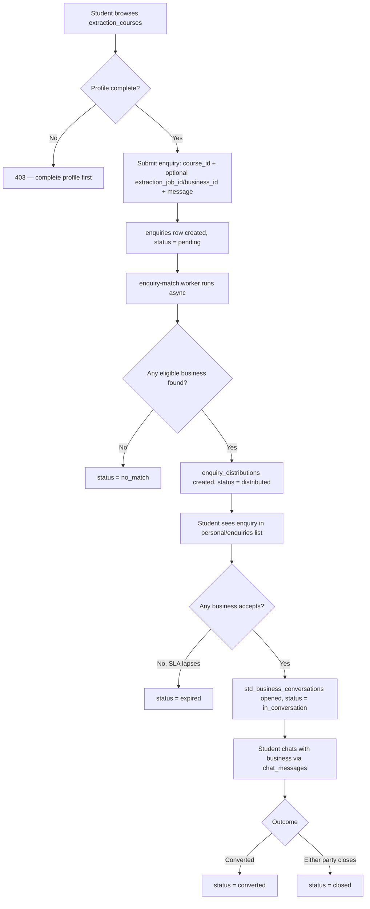
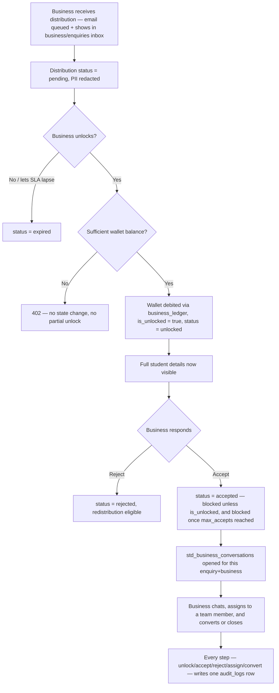
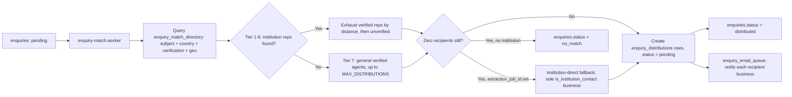

# Enquiry System — GlobalyApp-v3 PRD

> Status: **Greenfield build.** No enquiry table, matching logic, chat, or email-queue code exists in GlobalyApp-v3 today (verified by exhaustive backend search, see §7–§9). This document defines what must be built, using the old GlobalyApp system for business intent and the actual v3 codebase for every architectural and schema convention.
>
> Tagging key used throughout: **[V3-EXISTING]** verified in v3 code today · **[V3-REQUIRED]** must be built, derived from v3 conventions · **[PROPOSED]** new field/table/behavior not yet in v3, recommended here · **[OLD-REFERENCE]** business context from old GlobalyApp only, not implementation truth.

## 1. Overview

The Enquiry System is the lead-generation and monetisation core carried over in spirit from the original GlobalyApp: a student (personal-portal user) submits an enquiry expressing interest in studying at an institution/course, and the platform fans that enquiry out to a small set of eligible businesses (education agents and institution representatives) who pay to unlock the student's full details and then converse with them. **[OLD-REFERENCE]**

In GlobalyApp-v3, none of this exists yet — no `enquiries` table, no matching/distribution logic, no chat, no enquiry-specific email queue, no wallet/credit system. **[V3-EXISTING: absence confirmed]**. This PRD proposes the v3-native design: Fastify 5 + Knex 3 module following the same layering (routes → Zod schemas → services → repositories), tables living in the shared `globalyapp` schema (enquiry data is inherently cross-business and cannot live in a per-business tenant schema), LavinMQ-driven matching/distribution/email workers, and `extraction_courses.id` as the sole course reference. **[V3-REQUIRED]**

## 2. Goals

- Let a profile-complete student submit one enquiry that reaches the right businesses without the student manually contacting each agent. **[OLD-REFERENCE, carried forward]**
- Route enquiries by verification status, geographic proximity, and course/subject relevance, capped at a small number of recipients (default 5). **[OLD-REFERENCE, carried forward]**
- Gate full student PII behind a paid "unlock" action so unverified/non-paying businesses cannot harvest contact details. **[OLD-REFERENCE, carried forward]**
- Give a business a durable conversation thread with the student once they've committed (unlocked) to the lead. **[V3-REQUIRED]**
- Make every state transition auditable using v3's existing `audit_logs` table. **[V3-REQUIRED]**
- Keep the whole thing inside v3's existing conventions (Fastify/Knex/Zod/LavinMQ/RTK) — no new frameworks, no bespoke infra. **[V3-REQUIRED]**

## 3. Scope

In scope for v1, matching what the old system actually needed and what v3 already asks for — nothing speculative:

- Student enquiry submission (profile-completion gated) referencing a course (`extraction_courses.id`), with a message, preferred intake month/year.
- Matching/distribution algorithm: verified-before-unverified tiering, country + proximity ranking, capped fan-out, institution-direct fallback when zero agents match.
- Per-recipient distribution record carrying tier, coin cost, unlock state.
- Unlock-to-pay paywall against a wallet/ledger (must be built — v3 has none today, see §8).
- Accept/reject of an unlocked distribution with a max-accepts cap per enquiry (fixing the old system's known race condition by doing it with a row lock, not a naive count).
- One conversation per (enquiry, business), opened on accept, with append-only chat messages.
- Email notification on new distribution via a durable outbox table: one mail to the recipient's own inbox (not per team member), batched into a 5-minute summary (§17).
- Audit logging of every lifecycle transition into the existing `globalyapp.audit_logs`.
- Admin visibility into distributions, per-business coin cost configuration, suspension.

## 4. Out of Scope

Deliberately excluded — either the old system didn't need it, or it's speculative for v3 today. Ponytail/YAGNI applies:

- **AI-suggested chat replies** (`ai_reply_coin_cost`) — old PRD itself marks this "spec target, not yet implemented." Out of scope until product actually asks for it. **[OLD-REFERENCE]**
- **Lead export to external CRM webhooks** (`export-lead`) — no CRM/webhook subsystem exists in v3; old system's version was fire-and-forget with no audit trail anyway. Defer.
- **Review/rating requests on session idle/close** (`counseling_reviews`) — no such table or requirement exists in v3; belongs to a future Reviews module, not this one.
- **In-app notification center UI** — v3 has no generic `notifications` table or notification-center pattern. Email + inbox polling covers v1 (§17). Do not build a bespoke in-app notification system just for this module.
- **Real-time chat transport (WebSockets)** — v3 has no socket infrastructure anywhere (§7.6). Polling is sufficient for v1; do not introduce a new real-time layer for one module.
- **Multi-tier discounted pricing for unverified reps** — old system charged the same coin cost regardless of tier; keep that simplicity, don't invent a discount scheme nobody asked for.
- **Legacy Supabase data migration** — this is a greenfield build; backfilling old GlobalyApp enquiry rows is out of scope unless explicitly requested later (§29).

## 5. Business Context

**[OLD-REFERENCE — entire section]** The original GlobalyApp Enquiry System was a live Supabase/Lovable feature and Globaly's primary monetisation flow. A profile-complete student wrote an enquiry; the platform fanned it out to up to 5 eligible recipients using a 7-tier algorithm favoring verified institution reps over unverified ones, and country/proximity to the student within each verification band. General verified agents filled remaining slots. The target institution was only contacted directly when zero recipients were found across every tier. Each recipient saw a redacted teaser and had to spend credits to unlock full student details; only 3 of up to 5 recipients could ever unlock the same enquiry. Unlocking opened a chat thread. Business owners were notified by email immediately if their inbox was otherwise idle, else batched. Team admins could assign/reassign and mark conversions. Super admins tuned per-business coin cost and suspension flags.

## 6. Existing GlobalyApp Enquiry Behaviour

**[OLD-REFERENCE — entire section, from `/home/benziii/GlobalyHub/GlobalyApp/docs/prd/modules/enquiry-system.md`]**

- **Submission**: `enquiries` insert gated on `calculate_profile_completion() = 100`. Fire-and-forget call to `distribute-enquiry` edge function; failure does not roll back the insert.
- **Distribution (7 tiers, `distribute-enquiry`)**: exhausts verified institution reps (Tiers 1–4, banded by distance ≤20km / 20–50km / >50km-or-unknown / any-country) before any unverified rep (Tiers 5–6, same-country then any-country), then general verified agents not tied to the institution (Tier 7). Institution itself is added as sole recipient only if Tiers 1–7 found zero matches. Re-enquiry to the same institution excludes businesses the student already unlocked previously (anti-resale rule). Cost = `max(10, business.enquiry_coin_cost ?? 30)`, flat per distribution, no profile-completion multiplier. Deduplicated against existing distributions.
- **Notification**: every team member of a recipient business gets an in-app notification (`enquiry_received`) plus a row in `enquiry_email_queue`; the immediate digest fires if that recipient has no other pending queue rows, else the row is picked up by the next batch sweep.
- **Unlock (`unlock-enquiry`)**: caller must be a member of the recipient business; already-unlocked is idempotent; max 3 unlocks per enquiry (409 past that with no deduction); atomic credit deduction via a `deduct_credits` RPC; on success flips distribution to unlocked/viewed, flips parent enquiry to `viewed` + auto-assigns the unlocker, notifies the student, fires a fire-and-forget CRM export.
- **Chat & conversion**: unlocked card can start a chat (`chat_conversations`), team can reassign (`assigned_to`), mark converted (`status='converted'`, `converted_at`).
- **Known gaps flagged in the old PRD itself**: inconsistent default coin cost between distribution (30) and unlock fallback (20); hardcoded category UUID for Tier 7; no retry/redistribution on all-suspended or all-rejected; unlock-count race condition; no audit trail for CRM export success.

This is business intent only — none of the underlying schema, RPCs, or edge-function mechanics carry over into v3.

## 7. GlobalyApp-v3 Architecture Context

**[V3-EXISTING — verified directly against the repo]**

- **Stack**: Fastify `^5.0.0`, Knex `^3.1.0`, `pg ^8.13.0`, TypeScript `^5.7.0` (native ESM, `.js` import extensions, `tsx` runtime), Zod `^3.23.0` for validation, `amqplib` for RabbitMQ/LavinMQ, `nodemailer` for mail. (`backend/package.json`, `backend/tsconfig.json`)
- **Multi-tenancy**: schema-per-business inside one Postgres database — not separate logical databases. Three contexts: `globalyapp` (public schema, global tables e.g. `businesses`, `audit_logs`), `superadmin` (dedicated schema), and a dynamic per-business Postgres schema (`biz_{uuid}`) resolved per request. `backend/src/core/plugins/tenant.plugin.ts` sets `req.db`'s `searchPath = [biz_{id}, public]` based on `req.auth.orgId`. (`backend/knexfile.ts`, `backend/src/core/db/knex.ts`)
- **Queues**: `backend/src/shared/queue/` wraps `amqplib` in a `QueueService` with auto-scaling consumers; workers are standalone `tsx` processes run via npm scripts (`job:auth`, `job:extraction`, `job:extraction-pages`, `job:extraction-verify`), not embedded in the Fastify process. Queue name constants centralised in one `shared/queues.ts` per module (pattern from `data-extraction/shared/queues.ts`).
- **Module layering convention** (from `src/modules/superadmin/data-extraction/`, documented in that module's own `CLAUDE.md`): `routes/ → schemas/.parse() (Zod) → services/ (typed input, business logic, throws AppError subclasses) → repositories/ (all Knex lives here)`. One file per domain per layer. Auth guard applied once at module `index.ts` via an `onRequest` hook, not per-route.
- **Auth/RBAC**: JWT decoded by `auth.plugin.ts` into `req.auth = {sub, type, role?, orgId?, orgRole?, email}`. Guards: `requireAdmin`, `requireBusinessContext`, and `requirePermission(...perms)` which does a real per-business RBAC lookup — `agents.role_id → role_permissions → permissions` (permission keys are `"module:action"`), scoped inside the tenant schema. Superadmin routes use a simpler `requireSuperAdmin` allowlist check.
- **API conventions**: URLs are `/api/v3/{module}/...`. No single global response envelope — paginated list endpoints return `{data, meta: {page, limit, total, totalPages}}` via `src/shared/pagination.ts`'s `buildPaginatedResponse()`; simple CRUD action endpoints return bare result objects (`{id}`, `{updated: true}`). Errors are centralized in `error-handler.plugin.ts`: `AppError` subclasses → `{error, code}`, Zod failures → `{error: "Validation failed", details}`, Postgres unique violation → 409 `{error, code: "CONFLICT"}`.
- **Frontend**: Next.js 16 App Router, React 19, **Redux Toolkit** (not React Query) — `@reduxjs/toolkit`, `react-redux`. Feature-folder convention: `apis/` (client + `types.ts`), `store/<feature>-slice.ts` (RTK slice, one `createAsyncThunk` per operation), `components/`. No chat-like view exists anywhere in the frontend today.
- **Chat/real-time infrastructure**: **does not exist anywhere in v3** — no socket.io/ws dependency, no `chat`/`conversation` matches in the backend.
- **Generic audit log**: two existing append-only tables — `globalyapp.audit_logs` (`20260807_001_audit_logs.ts`: `id uuid`, `platform_user_id int nullable FK→platform_users`, `action text`, `entity_type text`, `entity_id text`, `org_id text`, `details jsonb default {}`, `ip_address text`, `created_at`) and `superadmin.admin_audit_logs` (parallel shape for admin actions). A thin `logAudit()` helper exists for the superadmin variant in `data-extraction/shared/audit.ts`.
- **Generic email/notification queue**: **does not exist** as a DB table anywhere in v3. Only `nodemailer` + a LavinMQ email worker (`src/modules/auth/jobs/email.worker.ts`) exist; there is no outbox table today.
- **`extraction_courses`**: real table, `superadmin` schema, migration `backend/database/migrations/superadmin/20260805_003_extraction_job_children.ts`. Columns: `id` (uuid PK), `job_id` (uuid, FK→`superadmin.extraction_jobs`, cascade), `name`, `short_name`, `degree_level`, `degree_level_code`, `subject_area`, `subject_area_code`, `duration_weeks` (int), `study_mode`, `description`, `domestic_fee_total` (decimal), `domestic_fee_installments`, `domestic_fee_heading`, `domestic_currency`, `domestic_eligibility`, `international_fee_total` (decimal), `international_fee_installments`, `international_currency`, `international_eligibility`, `awarding_institution`, `brochure_url`, `image_url`, `career_paths` (text[]), `country_code`, `course_status` (int), `source_url`, `verification_status` (default `'unverified'`), `last_verified_at`, `created_at`, `updated_at`. Indexed on `job_id`. A full CRUD module (`repositories/services/routes/schemas` under `data-extraction/`) already exists against this table, usable as this PRD's layering exemplar alongside it.

## 8. Database Architecture

**Schema placement — [V3-REQUIRED].** All new enquiry tables live in the shared `globalyapp` schema, not in a per-business tenant schema, because an enquiry is inherently cross-business (one enquiry fans out to N businesses; a per-business schema cannot hold a row another business also needs to read). This mirrors how `audit_logs` and `businesses` already live in `globalyapp`. Consequence: **Postgres gives zero automatic tenant isolation for these tables** — every business-scoped read/write must explicitly filter by `business_id` in the service layer (see §27).

**Tables required, with existence status:**

| Table | Status | Notes |
|---|---|---|
| `businesses` | **[V3-EXISTING]** — needs ALTERs | Core table exists; enquiry-specific columns (`enquiry_enabled`, `is_suspended`, `enquiry_coin_cost`, `latitude`, `longitude`) are **[PROPOSED]** additive columns, not yet present. Verify current columns before writing the migration; do not assume. |
| `extraction_courses` | **[V3-EXISTING]** | See §7. Used read-only as the FK target for `enquiries.course_id`. No changes needed to this table. |
| `extraction_jobs` / `extraction_institution_overview` | **[V3-EXISTING]** | `superadmin.extraction_jobs` carries bare `institution_name`/`institution_url` (migration `20260805_002_extraction_standalone.ts`); the richer institution profile — `name`, `website`, `phone`, `email`, `address`/`city`/`state`/`country`/`zip_code`, `description`, `logo_url`, social links — lives in `superadmin.extraction_institution_overview`, FK `job_id → extraction_jobs.id` cascade (migration `20260805_003_extraction_job_children.ts`). No unique constraint on `job_id`, but the existing `data-extraction` module treats it as 1:1 in practice (`jobs.repository.ts`: `.where({ job_id: id }).first()`) — this module follows the same convention. There is no separate `institutions` table in v3. `enquiries.extraction_job_id` / `representations.extraction_job_id` reference `extraction_jobs.id`; display-layer institution details (name, logo, address) are read from `extraction_institution_overview` via that same `job_id`. |
| `representations` | **[PROPOSED]** — does not exist | Business↔institution/service link; the eligibility substrate for tiers 1–6. |
| `enquiry_match_directory` | **[PROPOSED]** — does not exist | Denormalised routing index: business × subject-area × country × verification × geo × suspension. The join that lets matching run as a narrow SQL query instead of a full business scan. |
| `enquiries` | **[PROPOSED]** — does not exist | The student's submission; aggregate root. |
| `enquiry_distributions` | **[PROPOSED]** — does not exist | One row per (enquiry, recipient business); paywall + lifecycle state. |
| `credit_wallets` / `business_ledger` | **[PROPOSED]** — do not exist | Required substrate for the unlock paywall — v3 has no wallet/credit system at all today. This is the single largest new dependency this module introduces (see §33). |
| `std_business_conversations` | **[PROPOSED]** — does not exist | One conversation per (enquiry, business), opened on accept. |
| `chat_messages` | **[PROPOSED]** — does not exist | Append-only messages in a conversation. |
| `enquiry_email_queue` | **[PROPOSED]** — does not exist | Durable outbox for enquiry-related email; v3 has no generic equivalent to reuse. |
| `audit_logs` | **[V3-EXISTING]** | Reused as-is, no new table. A sibling `logEnquiryAudit()` helper is [V3-REQUIRED] (mirroring the existing superadmin helper, but targeting `globalyapp.audit_logs`). |

All new tables follow v3 migration conventions observed in the repo: `t.uuid("id").primary().defaultTo(gen_random_uuid())` for globalyapp-schema tables (matching the `audit_logs` convention), `t.timestamps(true, true)` + `t.timestamp("deleted_at").nullable()` for soft delete, raw `CREATE INDEX` statements after `createTable`. **[V3-REQUIRED]**

### 8.1 Proposed schema — `representations`
**[PROPOSED]**
```
id                uuid PK
business_id       int  FK -> businesses.id, not null
extraction_job_id uuid FK -> superadmin.extraction_jobs.id, nullable
extraction_course_id uuid FK -> superadmin.extraction_courses.id, nullable
status            text ('active' | 'inactive'), default 'active'
created_at, updated_at, deleted_at
UNIQUE(business_id, extraction_job_id, extraction_course_id)
```
Records which business represents which institution (`extraction_jobs`)/course, driving Tiers 1–6 eligibility. `extraction_job_id` replaces the earlier `institution_id` concept — `extraction_jobs.institution_name`/`institution_url` already identify the institution, so no separate `institutions` table is introduced.

### 8.2 Proposed schema — `enquiry_match_directory`
**[PROPOSED]**
```
id                    uuid PK
business_id           int  FK -> businesses.id, not null
subject_area          text, nullable   -- denormalised from extraction_courses.subject_area (no separate subject_areas table in v3)
country_code          text, nullable   -- denormalised from businesses.country / extraction_courses.country_code
verification_status   text ('verified' | 'unverified')
latitude, longitude   decimal, nullable  -- Tier 1-6 Haversine target
is_suspended          bool, default false
is_institution_contact bool, default false  -- true when no business represents the institution
synced_at, created_at, updated_at
```
A read-optimised routing index rebuilt/synced from `representations` + `businesses`, so matching runs as one narrow query rather than scanning all businesses.

### 8.3 Proposed schema — `enquiries`
**[PROPOSED]**
```
id                    uuid PK
student_id            int  FK -> platform_users.id, not null
course_id             uuid FK -> superadmin.extraction_courses.id, not null   -- RESOLVED per instruction, see §33
extraction_job_id     uuid FK -> superadmin.extraction_jobs.id, nullable   -- institution reference; replaces earlier institution_id
business_id           int  FK -> businesses.id, nullable  -- direct-target enquiry, bypasses matching
message               text, not null (10-5000 chars)
preferred_intake      text, nullable   -- month name
preferred_year        int, nullable
student_country_code  text, nullable   -- snapshot at submit time, for reproducible matching
student_latitude, student_longitude  decimal, nullable   -- snapshot
status                text: pending | distributed | accepted | in_conversation | converted | closed | no_match | expired
max_accepts           int, default 3
accept_count          int, default 0
distribution_count    int, default 0
last_distributed_at   timestamptz, nullable
closed_at             timestamptz, nullable
close_reason          text, nullable
created_at, updated_at, deleted_at
```
CHECK constraints: `status IN (...)`, `accept_count BETWEEN 0 AND max_accepts`, `char_length(message) BETWEEN 10 AND 5000`.

### 8.4 Proposed schema — `enquiry_distributions`
**[PROPOSED]**
```
id                uuid PK
enquiry_id        uuid FK -> enquiries.id, cascade
business_id       int  FK -> businesses.id, cascade
representation_id uuid FK -> representations.id, nullable (provenance)
tier              smallint, 1-7
match_rank        int
match_distance_km decimal, nullable
coin_cost         int, not null, default 0
is_unlocked       bool, default false
unlocked_at       timestamptz, nullable
unlocked_by       int[], nullable  -- business users who unlocked/viewed
status            text: pending | unlocked | accepted | rejected | expired | withdrawn
sla_expires_at    timestamptz, nullable
viewed_at, responded_at  timestamptz, nullable
responded_by      int, FK -> platform_users.id, nullable
rejection_reason  text, nullable
assigned_to       int, FK -> platform_users.id, nullable
converted_at      timestamptz, nullable
created_at, updated_at, deleted_at
UNIQUE(enquiry_id, business_id)
```
CHECK: `status <> 'accepted' OR is_unlocked = true` — enforces the paywall at the DB, not only in service code.

### 8.5 Proposed schema — `credit_wallets` / `business_ledger`
**[PROPOSED — required new subsystem, smallest viable shape]**
```
credit_wallets: id uuid PK, business_id int FK->businesses.id unique, balance int default 0, updated_at
business_ledger: id uuid PK, wallet_id uuid FK->credit_wallets.id, amount int (negative for spend),
                 type text ('enquiry_unlock'), ref_type text ('enquiry'), ref_id uuid, performed_by int FK->platform_users.id, created_at
```
Minimal two-table wallet — one balance column, one append-only ledger. No general-purpose billing/subscription system is proposed; that would be scope creep beyond what this module needs.

### 8.6 Proposed schema — `std_business_conversations`
**[PROPOSED]**
```
id                uuid PK
enquiry_id        uuid FK -> enquiries.id, cascade
distribution_id   uuid FK -> enquiry_distributions.id, nullable, unique
student_id        int  FK -> platform_users.id, cascade
business_id       int  FK -> businesses.id, cascade
business_user_id  int  FK -> platform_users.id, nullable (current assignee)
status            text: active | closed
closed_at         timestamptz, nullable
closed_by         int, nullable
message_count     int, default 0
last_message_at   timestamptz, nullable
created_at, updated_at, deleted_at
UNIQUE(enquiry_id, business_id)
```

### 8.7 Proposed schema — `chat_messages`
**[PROPOSED]**
```
id                    uuid PK
conversation_id       uuid FK -> std_business_conversations.id, cascade
sender_platform_user_id int FK -> platform_users.id, cascade
sender_side           text: student | business | system
sender_business_id    int, FK -> businesses.id, nullable
body                  text, not null (<=10000 chars)
seq                   bigint, monotonic per conversation
client_message_id     uuid, nullable (send idempotency)
read_at               timestamptz, nullable
created_at, updated_at, deleted_at
UNIQUE(conversation_id, seq)
UNIQUE(conversation_id, client_message_id)
```

### 8.8 Proposed schema — `enquiry_email_queue`
**[PROPOSED]**
```
id                uuid PK
enquiry_id        uuid, nullable, FK -> enquiries.id
distribution_id   uuid, nullable, FK -> enquiry_distributions.id
business_id       int, nullable, FK -> businesses.id
recipient_user_id int, nullable, FK -> platform_users.id
recipient_email   text, not null
template          text  -- enquiry_received | enquiry_accepted | ...
payload           jsonb, default {}
status            text: pending | sending | sent | failed | cancelled
attempts          int, default 0
dedup_key         text, unique  -- e.g. "enquiry_received:<dist_id>:<user_id>"
created_at, updated_at, sent_at
```

## 9. Entity Responsibilities

- **`enquiries`** — the student's intent; aggregate root; owns lifecycle status. **[PROPOSED]**
- **`representations`** — eligibility substrate: which business may be matched for which institution/course. **[PROPOSED]**
- **`enquiry_match_directory`** — pre-computed routing index (business × subject × country × verification × geo), rebuilt from `representations` + `businesses`, so the matcher queries a narrow set instead of scanning all businesses. **[PROPOSED]**
- **`enquiry_distributions`** — one row per (enquiry, business); owns paywall state (`is_unlocked`, `coin_cost`) and per-business lifecycle (`status`, accept/reject/expiry). **[PROPOSED]**
- **`credit_wallets` / `business_ledger`** — business's spendable balance and the append-only spend history. **[PROPOSED]**
- **`std_business_conversations`** — one thread per accepted (enquiry, business) pair. **[PROPOSED]**
- **`chat_messages`** — append-only messages inside a conversation. **[PROPOSED]**
- **`enquiry_email_queue`** — durable outbox, decoupled from the request path and from LavinMQ message loss. **[PROPOSED]**
- **`audit_logs`** — durable record of every transition across all of the above. **[V3-EXISTING, reused]**
- **`businesses`** — carries the per-business config the matcher and paywall read (`enquiry_enabled`, `is_suspended`, `enquiry_coin_cost`, `latitude`/`longitude`). **[V3-EXISTING core + PROPOSED ALTERs]**
- **`extraction_courses`** — the course being enquired about; read-only from this module's perspective. **[V3-EXISTING]**
- **`extraction_jobs` / `extraction_institution_overview`** — the institution being enquired about; read-only. `extraction_jobs.id` is the FK target for `enquiries.extraction_job_id`; `extraction_institution_overview` (joined on `job_id`) supplies the display-layer institution profile (name, logo, address, contact) shown in enquiry list/detail views. **[V3-EXISTING]**

## 10. Database Relationships

```
platform_users (student) ──1:N──▶ enquiries
extraction_courses ───────1:N──▶ enquiries.course_id
superadmin.extraction_jobs ─1:N──▶ enquiries.extraction_job_id (nullable)
businesses ────────────────1:N──▶ enquiries.business_id (nullable, direct-target)

enquiries ─────────────────1:N──▶ enquiry_distributions
businesses ────────────────1:N──▶ enquiry_distributions
representations ───────────1:N──▶ enquiry_distributions (provenance, nullable)

businesses ────────────────1:1──▶ credit_wallets
credit_wallets ────────────1:N──▶ business_ledger
business_ledger.ref_id ────────▶ enquiries.id  (looked up by ref_type='enquiry' + ref_id, no stored FK from enquiry_distributions)

enquiries ─────────────────1:N──▶ std_business_conversations
enquiry_distributions ─────1:1──▶ std_business_conversations (nullable)
std_business_conversations ─1:N──▶ chat_messages

enquiries ─────────────────1:N──▶ enquiry_email_queue
enquiry_distributions ─────1:N──▶ enquiry_email_queue

(all state transitions) ──────────▶ audit_logs (entity_type/entity_id, no FK — append-only log)
```

`representations` and `enquiry_match_directory` are both read by the matcher; `enquiry_match_directory` is a denormalised, resyncable projection of `representations` + `businesses` and is not itself a source of truth for eligibility. **[PROPOSED]**

## 11. Enquiry Lifecycle

Status values on `enquiries`: `pending → distributed → (accepted | no_match) → in_conversation → converted | closed`, with `expired` reachable from `distributed` if every distribution's SLA lapses. **[PROPOSED]**

1. **pending** — created by student, not yet matched.
2. **distributed** — matcher has written ≥1 `enquiry_distributions` row.
3. **no_match** — matcher found zero eligible businesses and no institution fallback was eligible either.
4. **accepted** — at least one distribution reached `accepted`.
5. **in_conversation** — a `std_business_conversations` row is open and has ≥1 message.
6. **converted** — a business marked their distribution converted.
7. **closed** — student or admin closed the enquiry manually.
8. **expired** — all distributions passed their SLA without accept/reject and no redistribution occurred.

This is a superset of the old system's five-state vocabulary (`Pending/Viewed/Responded/Closed/Converted`) — `distributed`/`no_match`/`expired` give the SLA/redistribution behaviour the old system explicitly lacked ("no retry", "no resend/re-distribution" were called out as gaps in §6). Per-distribution `viewed` state lives on `enquiry_distributions.viewed_at`, not on the parent enquiry, because an enquiry seen by one of five businesses is not "viewed" as a whole. **[PROPOSED]**

## 12. Matching Logic

**[OLD-REFERENCE business rule, PROPOSED v3 implementation]** Preserves the old system's 7-tier ladder, verified-before-unverified, ranked by distance/country to the *student*:

1. Verified reps of the target institution, same country as student, ≤20km.
2. Verified reps, same country, 20–50km.
3. Verified reps, same country, >50km or distance not computable.
4. Verified reps, any country/distance ("global verified").
5. Unverified reps, same country, any distance.
6. Unverified reps, any country/distance ("global unverified").
7. General verified agents not tied to the institution (matched via `enquiry_match_directory.is_institution_contact = false`), filling remaining slots up to `MAX_DISTRIBUTIONS` (default 5, configurable).

Institution-direct fallback: if Tiers 1–7 produce zero recipients, and `enquiries.extraction_job_id` resolves to a business acting as that institution's contact (`is_institution_contact = true` in the directory), that single business becomes the sole recipient. Never added alongside a matched agent.

Re-enquiry exclusion: businesses the student already unlocked for the same institution/course are excluded from a fresh enquiry's candidate set (anti-resale rule from the old system, kept verbatim).

Direct-target short circuit: if `enquiries.business_id` is set (student is enquiring to a specific agency directly), matching is skipped entirely and one distribution is written to that business. **[PROPOSED — new capability, not in old system]**

Distance is computed against `enquiry_match_directory.latitude/longitude` (business side) and `enquiries.student_latitude/longitude` (snapshot taken at submission, not the live profile — matching must be reproducible after the student edits their profile later). Country match uses `enquiry_match_directory.country_code` vs `enquiries.student_country_code`. Matching runs in a LavinMQ worker (`enquiry-match.worker.ts`), triggered after the enquiry insert commits — not fire-and-forget HTTP as in the old system, but a durable queue publish, so a worker crash does not silently drop the match. **[PROPOSED]**

## 13. Distribution Logic

- Matcher writes one `enquiry_distributions` row per matched business, `ON CONFLICT (enquiry_id, business_id) DO NOTHING` — duplicate prevention is a DB constraint, not an app-level check-then-insert (upgrade over the old system, which only had an application check). **[PROPOSED]**
- `coin_cost` per distribution = `businesses.enquiry_coin_cost` (default 30, single consistent default — the old system's inconsistency between the distribution default (30) and unlock fallback default (20) is explicitly not repeated here). **[PROPOSED]**
- Each new distribution triggers: (a) exactly ONE email-queue row, addressed to the recipient's own inbox — `businesses.email` (owner as fallback) or `institutions.email` (§17), (b) nothing to a `notifications` table — none exists and none is proposed (§4 Out of Scope).
- Distribution worker resolves recipient users for a business via the existing `agents` / tenant-membership tables, not a bespoke lookup. **[V3-REQUIRED, reuse existing tables]**

## 14. Business Workflow

1. Business sees distribution in inbox, tabbed **Locked / Unlocked / Accepted / Closed** based on `is_unlocked` and `status` (carried forward from old system's Locked/Unlocked tabs, extended for the new accept/reject states). **[PROPOSED]**
2. **Unlock** (`POST /distributions/:id/unlock`) — debits `coin_cost` from `credit_wallets` inside the same transaction as flipping `is_unlocked = true`, `unlocked_at`, appending to `unlocked_by`; insufficient balance → 402, no state change; already-unlocked → idempotent 200 `{already_unlocked: true}`.
3. **Accept** (`POST /distributions/:id/accept`) — requires `is_unlocked = true`; uses `SELECT ... FOR UPDATE` on the parent `enquiries` row to check `accept_count < max_accepts` before incrementing — closes the old system's flagged unlock-count race condition by using a row lock instead of a naive pre-check. On success, opens a `std_business_conversations` row.
4. **Reject** (`POST /distributions/:id/reject`) — sets `status='rejected'`; if all distributions on the enquiry are now rejected/expired, publishes a redistribution event.
5. **Assign / reassign** — `assigned_to` lives on `enquiry_distributions` (per-business assignment), not on the parent `enquiries` row, because five different businesses may each assign their own counsellor to the same enquiry — a deliberate divergence from the reference material's institution-wide assignee field. **[PROPOSED]**
6. **Mark converted** — sets `status='converted'`, `converted_at=now()`.

## 15. Conversation Workflow

- One `std_business_conversations` row per (enquiry, business) — `UNIQUE(enquiry_id, business_id)`. Opened only on **accept**, inside the same transaction as the accept (not on unlock). **[PROPOSED]**
- `business_user_id` on the conversation is the *current* assignee and may be reassigned without breaking the thread.
- Conversation carries denormalised `message_count`/`last_message_at` to avoid N+1 queries on inbox list rendering. **[PROPOSED]**
- Either party may close the conversation (`status='closed'`, `closed_at`, `closed_by`); no idle-session auto-close cron is proposed for v1 — the old system's review-request-on-idle behaviour is out of scope (§4).

## 16. Chat Workflow

- Messages are append-only rows in `chat_messages`, ordered by a per-conversation monotonic `seq` (not by timestamp, to avoid clock-skew/same-millisecond ordering bugs) allocated inside the same transaction that increments the conversation's `message_count` under a row lock. **[PROPOSED]**
- `sender_side` (`student | business | system`) plus `sender_platform_user_id` disambiguate who sent a message; there is no separate `receiver_id` — the receiver is implicit (whichever side isn't the sender), matching the pattern in the old system's chat. **[PROPOSED]**
- `client_message_id` + a unique constraint gives send-idempotency against client retries.
- No WebSocket transport is proposed for v1; the frontend polls the conversation's messages endpoint (§21, §26 Out of Scope for real-time infra rationale).

## 17. Email/Notification Workflow

- On each new distribution, insert exactly ONE `enquiry_email_queue` row with a `dedup_key`, addressed to the recipient's shared inbox: `businesses.email` (falling back to the owner's address when unset) or `institutions.email`. **Team members are NOT mailed individually** — that fan-out turned one enquiry into one message per member and was the multiplier behind the volume problem. The enquiry is still visible to every member in the inbox UI. `recipient_user_id` is therefore always NULL and the dedup key ends in `:business` / `:institution`.
- **[SUPERSEDED]** ~~If the recipient has no other `pending` queue rows, fire an immediate send job; otherwise the row waits for the next batch sweep ("immediate if idle, else batched").~~ That rule never held under load: one enquiry fans out to every member of every matched business, so a burst of 100 enquiries meant ~800 messages and the provider rejected the tail. **New-enquiry notices are now queued only, never sent on the request path.**
- **5-minute summary.** `sweepDigests()` collects every pending row for one `(recipient_email, template)` group whose *oldest* row has aged past `ENQUIRY_EMAIL_WINDOW_MS` (default 5 min) and sends **one** mail listing all of them, each deep-linked to `/business/enquiries/<distribution_id>/student`. Batched templates: `enquiry_distributed`, `enquiry_institution_fallback`. `enquiry_unlocked` (to the student) still sends immediately.
- The window is tumbling, not sliding: once a group is due, the sweep takes everything currently pending for it. At most one summary per address per template per window, and no permanent un-sent tail behind the cutoff. A group of exactly one renders the single-enquiry mail, not a one-item list.
- Grouping is on `recipient_email`, not `business_id` — someone who belongs to two matched businesses gets one mail, with the business named per row.
- Concurrency: each group is claimed with `FOR UPDATE SKIP LOCKED`. A digest resolves N rows with one message, so a lost race would mean a duplicate *summary*; a second worker finds zero rows and moves on.
- The summary carries only pre-unlock fields (student **first name**, course, institution, intake). Contact details stay behind the paywall — an email is the easiest thing in the product to forward to someone who never paid.
- Sweep runs as a long-lived worker (`npm run job:enquiry-email`, `ENQUIRY_EMAIL_POLL_MS`, default 60s); `--once` does a single pass for cron or a manual drain.
- Delivery uses the existing `nodemailer`-backed mail path (`mailerService.sendMail`), fire-and-forget from the request path, never blocking distribution. **[V3-REQUIRED, reuse existing]**
- No in-app notification table (§4 Out of Scope) — email is the only notification channel for v1.

## 18. Audit Logging

Every state transition writes one row to the existing `globalyapp.audit_logs` table (§7), in the same transaction as the state change, via a new `logEnquiryAudit()` helper (sibling to the existing superadmin `logAudit()` helper — that one targets `superadmin.admin_audit_logs` with a different shape, so a new module-local helper is needed, not a reuse). **[V3-REQUIRED]**

Vocabulary: `enquiry.created`, `.distributed`, `.no_match`, `.closed`, `.converted`; `distribution.viewed`, `.unlocked`, `.accepted`, `.rejected`, `.expired`, `.reassigned`; `conversation.opened`, `.closed`; `representation.created`, `.verified`, `.suspended`. Message *content* is never copied into audit details (PII + volume); only the message id and conversation id are logged for `conversation.message_sent`. **[PROPOSED]**

## 19. Roles & Permissions

Reuses the existing v3 RBAC model (§7) — no new permission mechanism. **[V3-REQUIRED]**

- **Student (platform user, personal portal)**: create own enquiries, view own distributions/conversations. Authorization: `req.auth.type === 'personal'` (or equivalent) + row ownership check (`student_id = req.auth.sub`), not a business-scoped permission.
- **Business agent/rep (tenant context)**: view/unlock/accept/reject/assign distributions for their own business only, gated by `requirePermission("enquiries:view")`, `"enquiries:unlock"`, `"enquiries:respond"` — new permission keys to seed into the existing `permissions` table, following the `"module:action"` convention already in use.
- **Business owner/admin**: additionally reassign and configure nothing enquiry-specific beyond standard team management (already exists).
- **Super admin**: configure `businesses.enquiry_coin_cost`, `enquiry_enabled`, `is_suspended`; view all distributions for support/audit; force redistribution. Gated by the existing `requireSuperAdmin` guard.

## 20. API Requirements

Following existing `/api/v3/{module}` convention (§7), `{data, meta}` for paginated lists, bare objects for actions, centralized `AppError` → `{error, code}` format. **[PROPOSED]**

- `POST /api/v3/enquiries` — student creates an enquiry.
- `GET /api/v3/enquiries` — student's own enquiries, paginated.
- `GET /api/v3/enquiries/:id` — student's own enquiry detail.
- `PATCH /api/v3/enquiries/:id/close` — student/admin closes.
- `GET /api/v3/enquiry-distributions` — business inbox, tenant-scoped, paginated, filterable by status.
- `POST /api/v3/enquiry-distributions/:id/unlock`
- `POST /api/v3/enquiry-distributions/:id/accept`
- `POST /api/v3/enquiry-distributions/:id/reject`
- `PATCH /api/v3/enquiry-distributions/:id/assign`
- `PATCH /api/v3/enquiry-distributions/:id/convert`
- `GET /api/v3/conversations/:id/messages` — paginated
- `POST /api/v3/conversations/:id/messages`
- `PATCH /api/v3/conversations/:id/close`
- `GET/POST /api/v3/admin/representations` — superadmin CRUD on the eligibility substrate.
- `PATCH /api/v3/admin/businesses/:id/enquiry-settings` — coin cost, enabled, suspended.

## 21. Frontend Requirements

Follows the existing feature-folder + Redux Toolkit convention (§7), no new state library. **[PROPOSED]**

- `frontend/src/app/personal/enquiries/` — list + new-enquiry form + detail/conversation view, `apis/`, `store/enquiries-slice.ts` with thunks for create/fetch/close.
- `frontend/src/app/business/enquiries/` — inbox list (Locked/Unlocked/Accepted/Closed tabs), detail view with unlock/accept/reject/assign/convert actions, conversation panel; `store/business-enquiries-slice.ts`.
- `frontend/src/app/admin/enquiries/` — read-only ledger/audit view, per-business coin-cost/suspension controls; extends the existing `frontend/src/app/admin/monitoring/enquiries/` stub which currently has a 5-field mock (`id, name, subject, channel, status`) — that stub's `apis/types.ts` must be replaced with the real distribution shape, not kept alongside it.
- Chat UI polls the messages endpoint on an interval (no WebSocket infra exists to build on, §16).

## 22. State Machines

**Enquiry** (`enquiries.status`):
```
pending → distributed → { accepted, no_match }
distributed → expired (all distributions lapse)
accepted → in_conversation → { converted, closed }
any non-terminal → closed (manual)
```

**Distribution** (`enquiry_distributions.status`):
```
pending → unlocked → { accepted, rejected }
pending/unlocked → expired (SLA lapse)
accepted → withdrawn (rare, admin/business initiated)
```
Constraint: `accepted` requires `is_unlocked = true` (enforced by CHECK, §8.4) — acceptance can never bypass the paywall. **[PROPOSED]**

**Conversation**: `active → closed` (either party), no further states.

## 23. Transactions & Concurrency

- **Enquiry creation**: single transaction — insert `enquiries` row + `audit_logs` row; queue publish happens only after commit (transactional outbox pattern, not inside the DB transaction). **[PROPOSED]**
- **Accept**: `SELECT ... FOR UPDATE` on the `enquiries` row before checking/incrementing `accept_count`, in the same transaction as flipping the distribution to `accepted` and inserting the conversation row — closes the old system's documented unlock-count race condition.
- **Unlock**: wallet debit (`business_ledger` insert + `credit_wallets.balance` update) and the distribution's `is_unlocked` flip happen in one transaction; insufficient balance aborts the whole transaction (nothing partially applied).
- **Chat send**: `seq` allocation + `message_count` increment + message insert in one transaction, row-locked on the conversation.
- **Distribution insert**: `ON CONFLICT (enquiry_id, business_id) DO NOTHING` makes concurrent matcher retries safe without a lock.

## 24. Background Jobs

Standalone `tsx` worker entrypoints via `npm run job:*`, matching the existing `job:auth`/`job:extraction*` pattern — not embedded in the Fastify process. **[V3-REQUIRED pattern, PROPOSED workers]**

- `enquiry-match.worker.ts` — consumes `enquiry.created`, runs matching (§12), writes distributions, publishes `enquiry.distributed`.
- `enquiry-email.worker.ts` — consumes queued email sends, calls `mailerService.sendMail`, marks sent/failed with retry/backoff.
- `enquiry-email-batch.worker.ts` (or a cron-triggered script) — sweeps `pending` email-queue rows not picked up immediately.
- `enquiry-expiry.worker.ts` — periodic sweep of distributions past `sla_expires_at`, flips to `expired`, may trigger redistribution.

## 25. Error Handling

Reuses the existing centralized `error-handler.plugin.ts` conventions (§7) — no bespoke error format for this module. **[V3-REQUIRED]**

- Profile incomplete → 403 `AppError` subclass before an enquiry can even be created (checked in the service layer against the existing profile-completion field).
- Insufficient wallet balance on unlock → 402 `{error, code: 'INSUFFICIENT_BALANCE', required, available}`.
- Max-accepts reached → 409 `{error, code: 'MAX_ACCEPTS_REACHED'}`.
- Duplicate distribution attempt → absorbed by the DB `ON CONFLICT`, not surfaced as an error.
- Matcher finds zero eligible businesses and no institution fallback → enquiry moves to `no_match`, not an error — this is a valid terminal state, not a failure response to any caller.
- Queue publish failure after enquiry insert → logged, enquiry remains `pending`; an admin/cron re-publish path is required so this isn't a silent dead end (an explicit improvement over the old system's "fire-and-forget with no retry").

## 26. Edge Cases

Carried forward from the old system plus v3-specific additions:

- Enquiry submitted with no `extraction_job_id` and no `business_id` → matching runs Tier 7 only (general agents); if that also finds nothing, enquiry is `no_match`, there is no institution to fall back to. **[OLD-REFERENCE]**
- Student has no country/coordinates on their profile at submission time → country-match tiers (1,2,3,5) are skipped; global tiers (4,6) still run in verified-before-unverified order. **[OLD-REFERENCE]**
- All matched businesses are later suspended → existing distributions remain unlockable (state doesn't retroactively change), but no new distributions are created for that business. **[OLD-REFERENCE]**
- Wallet has zero balance at unlock time → 402, no state change, no partial unlock. **[PROPOSED, v3 wallet doesn't exist yet]**
- Re-clicking unlock on an already-unlocked distribution → idempotent success, no double charge. **[OLD-REFERENCE]**
- All distributions rejected or expired → enquiry should be eligible for redistribution (a new "round"), not stuck permanently in `distributed` — explicit fix for the old system's flagged "no retry / no resend" gap. **[PROPOSED]**
- Direct-target enquiry (`business_id` set) to a suspended/disabled business → creation should fail fast with a clear error rather than silently producing a zero-distribution enquiry. **[PROPOSED]**
- Two team members from the same business both click unlock near-simultaneously → `unlocked_by` array append + the transaction-scoped wallet debit must not double-charge; the second call sees `is_unlocked = true` already and returns idempotently rather than re-debiting. **[PROPOSED]**

## 27. Security Requirements

- **Tenant isolation is application-code, not Postgres-enforced**, because these tables live in the shared `globalyapp` schema (§8). Every business-scoped query must filter by `business_id` derived from `req.auth.orgId`, never trust a client-supplied business id. This is the single biggest security risk introduced by this module and must be covered by IDOR-focused tests (§30). **[PROPOSED, flagged risk]**
- Student PII (full message, contact details) must never be present in a distribution payload before `is_unlocked = true` — the pre-unlock view must be a redacted teaser, matching the old system's redaction gate. **[OLD-REFERENCE, carried forward]**
- Unlock/accept/reject/assign all require `requirePermission` checks scoped to the acting business, reusing the existing RBAC (§19), not a bespoke ACL.
- Superadmin read access to chat message content should default to **no** unless a support/compliance need is explicitly established — flagged as an open question (§33), not assumed.
- Audit rows must never contain message body content (§18).

## 28. Performance Requirements

- Matching should complete well under 2 seconds for the median enquiry — achievable because `enquiry_match_directory` pre-narrows the candidate set to a few hundred rows at most, versus scanning all businesses (an explicit improvement over the old system's full-table JS-side Haversine scan). **[PROPOSED]**
- Unlock should complete in a single DB round trip's worth of transaction (~well under 500ms), matching the old system's target.
- Business inbox list queries must be indexed on `(business_id, status, created_at)`; conversation queries indexed on `(conversation_id, seq)`.
- Email sending must never block the request path — always queued, never synchronous (§17).

## 29. Migration/Compatibility Considerations

- This is a greenfield build — no legacy Supabase enquiry data is migrated as part of this PRD's scope. If backfill is later required, it's a separate, explicitly-scoped effort (old system's schema is entirely different: Supabase RLS/RPCs vs. Fastify/Knex services). **[PROPOSED — decision, not silently assumed]**
- The frontend stub at `frontend/src/app/admin/monitoring/enquiries/` (mock 5-field shape) must be replaced, not left running in parallel with the real module, to avoid two divergent "enquiries" concepts in the codebase. **[V3-EXISTING finding, PROPOSED remediation]**
- `businesses` table ALTERs (`enquiry_enabled`, `is_suspended`, `enquiry_coin_cost`, `latitude`, `longitude`) must be additive, nullable-with-sensible-defaults migrations that don't disrupt any existing business functionality. **[PROPOSED]**

## 30. Testing Requirements

Following existing repo test conventions (Vitest, transaction-rollback-per-test for DB-touching tests, `app.inject` for HTTP-level tests — verify exact tooling against an existing module's test setup before writing new tests). **[V3-REQUIRED pattern]**

- Unit tests (no DB) for the pure matching/ranking function — tiering order, distance banding, country-match fallback behaviour.
- Service-level tests against real Postgres: unlock idempotency, insufficient-balance abort, accept race (two concurrent accept calls against `max_accepts = 3`, only 3 should win), duplicate-distribution prevention via the unique constraint.
- Integration/HTTP tests: full submit → match → unlock → accept → message flow.
- IDOR tests: business A must never read/act on business B's distributions or conversations, given the shared-schema tenant model (§27).
- Redistribution edge case: all distributions rejected → enquiry becomes eligible for a new matching round.

## 31. Implementation/File Structure Mapping

Mirrors the `data-extraction` module's layering (§7), as the closest existing exemplar:

```
backend/database/migrations/globalyapp/
  2026XXXX_00X_representations.ts
  2026XXXX_00X_enquiry_match_directory.ts
  2026XXXX_00X_enquiries.ts
  2026XXXX_00X_enquiry_distributions.ts
  2026XXXX_00X_credit_wallets_and_ledger.ts
  2026XXXX_00X_std_business_conversations.ts
  2026XXXX_00X_chat_messages.ts
  2026XXXX_00X_enquiry_email_queue.ts
  2026XXXX_00X_businesses_enquiry_columns.ts   (ALTER)

backend/src/modules/enquiries/
  index.ts                       -- route registration + onRequest auth hook
  routes/{enquiries,distributions,conversations}.routes.ts
  schemas/{enquiries,distributions,conversations}.schema.ts   (Zod)
  services/{enquiries,matching,distributions,conversations,wallet}.service.ts
  repositories/{enquiries,distributions,conversations,representations,match-directory,wallet}.repository.ts
  jobs/{enquiry-match,enquiry-email,enquiry-expiry}.worker.ts
  shared/{queues.ts,audit.ts,ranking.ts}

frontend/src/app/personal/enquiries/{apis,store,components}/
frontend/src/app/business/enquiries/{apis,store,components}/
frontend/src/app/admin/enquiries/{apis,store,components}/   (replaces the monitoring/enquiries stub)
```
**[PROPOSED]**

## 32. Acceptance Criteria

- A profile-incomplete student cannot create an enquiry (403 before any DB write).
- A complete-profile student submitting a valid enquiry against a real `extraction_courses.id` gets a `pending` enquiry and, after the match worker runs, ends up `distributed` or `no_match`.
- Matching never returns more than `MAX_DISTRIBUTIONS` (default 5) recipients and never mixes an institution-fallback recipient with any matched agent.
- Verified institution reps are always fully exhausted before any unverified rep is considered, regardless of distance.
- A business cannot see redacted student PII before unlocking, and cannot unlock without sufficient wallet balance.
- At most `max_accepts` (default 3) distributions on the same enquiry can ever reach `accepted`, verified under concurrent load.
- Every unlock/accept/reject/assign/convert writes exactly one `audit_logs` row.
- A business can never read or act on another business's distribution, conversation, or message rows.
- Email is sent immediately for an otherwise-idle recipient and batched otherwise; no email is ever sent twice for the same `dedup_key`.

## 33. Open Questions / Decisions Required

- **[RESOLVED, closed item]** — The course-reference conflict between the reference-PDF's own `Courses`/`business_Courses` tables and the actual v3 requirement is resolved per explicit instruction: `enquiries.course_id` and `enquiry_distributions.course_id`/provenance FK use **`extraction_courses.id`** exclusively. No separate course table is introduced. This closes what the prior planning drafts labeled the "#1 blocking conflict" (§22a in the trashed draft).
- **Wallet/ledger scope** — v3 has no credit/wallet system at all today (§8.5 proposes the smallest viable two-table shape). Is a full billing/wallet module planned elsewhere that this should integrate with instead of building its own, or is the minimal `credit_wallets`/`business_ledger` pair here acceptable as the permanent home? Needs a decision before Phase-6-equivalent (unlock) work starts, because the debit must share the unlock transaction.
- **[RESOLVED, closed item]** — The earlier open question about a separate `institutions` table is closed: v3 has no such table, and none is introduced. `extraction_jobs` (`superadmin` schema) already carries `institution_name`/`institution_url`, so `enquiries.extraction_job_id` and `representations.extraction_job_id` reference `superadmin.extraction_jobs.id` directly in place of the earlier `institution_id` concept.
- **`businesses.enquiry_coin_cost` / `enquiry_enabled` / `is_suspended` / `latitude` / `longitude`** — proposed as additive ALTERs; confirm none of these column names collide with existing or differently-shaped columns before migrating.
- **Superadmin chat read access** — no compliance stance has been set; default recommendation here is "no read access without an explicit support ticket flow," but this is a product/legal call, not an engineering one.
- **Redistribution trigger granularity** — should an all-rejected enquiry auto-redistribute immediately, or only via an admin/cron action? The old system had neither; this PRD proposes automatic eligibility but leaves the trigger mechanism (immediate vs. scheduled) undecided.
- **Direct-target enquiry pricing** — when a student enquires directly to one business (`business_id` set, matching bypassed), should coin cost differ from a matched lead? Not specified by the old system (which had no such feature) and not decided here.

## 34. Implementation Checklist

- [ ] Confirm current `businesses` columns before writing ALTER migrations (§8, §33).
- [ ] Decide wallet/ledger scope (§33) before starting distribution/unlock work.
- [ ] Migrations: `representations`, `enquiry_match_directory`, `enquiries`, `enquiry_distributions`, `credit_wallets`, `business_ledger`, `std_business_conversations`, `chat_messages`, `enquiry_email_queue`, `businesses` ALTERs.
- [ ] Seed new permission keys (`enquiries:view`, `enquiries:unlock`, `enquiries:respond`, etc.) into the existing `permissions` table.
- [ ] Backend module `modules/enquiries/` — repositories → services → schemas → routes → `index.ts` registration in `server.ts`.
- [ ] `enquiry-match.worker.ts`, `enquiry-email.worker.ts`, `enquiry-expiry.worker.ts`, queue name constants.
- [ ] `logEnquiryAudit()` helper targeting `globalyapp.audit_logs`.
- [ ] Frontend: `personal/enquiries`, `business/enquiries`, replace `admin/monitoring/enquiries` stub with the real `admin/enquiries` module.
- [ ] Unit tests for pure matching/ranking logic (test-first, per repo convention).
- [ ] Concurrency tests: accept race under `max_accepts`, unlock double-charge race.
- [ ] IDOR test suite across all business-scoped endpoints.
- [ ] Verify email dedup/idempotency under simulated retries.

## Appendix A — User Flow Diagrams

### A.1 Student flow



### A.2 Business flow



### A.3 Matching → distribution (system flow)


